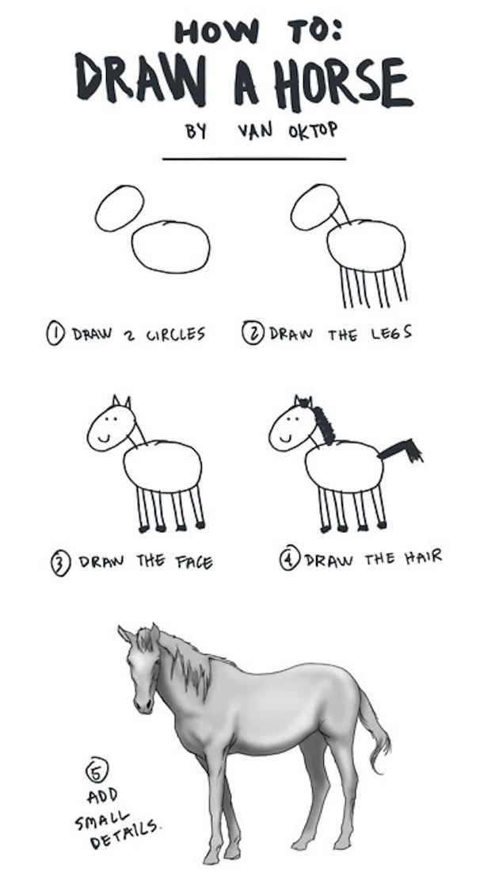

# Premières configurations

::: warning Information importante
Le fichier `config.js` est un fichier Javascript. Dans cette partie, nous allons faire "comme si" vous n'aviez jamais entendu parler de Javascript, ou en tout cas que vous ne savez pas trop vous en servir. Les explications détaillées viendront plus tard.
:::

## Afficher la sidebar

La "sidebar", c'est la barre de navigation qui se trouve à gauche, avec les liens vers les différentes parties du documents, et les différentes pages.

Si vous avez encore le serveur de développement est route, il faut faire CTRL+C dans le terminal pour le quitter.

Dans le fichier `config.js` vous aller taper, ou copier-coller le code suivant.

``` js
// .vuepress/config.js
module.exports = {
    themeConfig: {
      sidebar: [
        '/',
        '/docs/',
      ]
    }
  }
```

Puis dans le fichier `docs/README.md` vous allez entrer:

``` md
// docs/README.md
# Un premier document

Voici mon premier document

```

Pour info, mais vous avez du comprendre, la première ligne indique juste le nom du fichier, et ne doit pas être copiée :)

Une fois ces fichiers enregistrés, dans le terminal, nous allons relancer le serveur:

``` bash
vuepress dev
```

Et la "magie" opère: nous avons une sidebar, c'est-à-dire une barre de navigation à gauche !

## Et là, ça se complique un peu...

Si vous avez déjà suivi de tutos informatiques, ou même si c'est votre premier, nous arrivons à la configuration suivante:



En gros: tout est "relativement" simple, puis dès qu'on veut ajouter quelques fonctionnalités, comme par exemple pouvoir écrire des mathématiques, ou personnaliser les liens de navigation, il faut lire les documentations, et passer du temps à Googleliser partout.

Dans la suite de ce tuto, nous allons expliquer les fondamentaux du paramétrage de Vuepress pour "ajouter les quelques détails" :)
