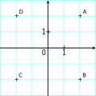

# Exercices Complexes - Partie 2

## Module et argument
::: tip Exercice 1 [ ]

Dans le plan complexe représenter, dans chacun des cas suivants, les points $M$ dont les affixes $z$ remplissent la condition donnée :

1.   $\arg(z)=\frac{\pi}{3}$

2.   $|z|=5$

3.  $|z|=3$ et $\arg(z)=\pm \pi$

4.  $\arg(z)=-\pi$

<ClientOnly><Solution>

1.  C'est la demi-droite issue de l'origine (exclue) et formant un angle de $\dfrac{\pi}{3}$ avec l'axe des abscisses.

2.  C'est le cercle de centre l'origine et de rayon 5.

3.  Ce sont les deux points du cercle de centre l'origine et de rayon 3 qui sont situés sur l'axe des abscisses.

4.  C'est la partie de l'axe des réel avec une partie réelle négative (sauf l'origine).

</Solution>
:::

::: tip Exercice 2 [ ]

Déterminer le module et un argument des nombres complexes suivants :

1.  $z_1=7$

2.  $z_2=2i$

3.  $z_3= \frac{-1+i}{3}$

4.  $z_4= \sqrt{3}+i$

<ClientOnly><Solution>

1.  $|z_1|=7$ et $\arg(z_1)=0$.

2.   $|z_2|= 2$ et $\arg(z_2)=\frac{\pi}{2}$

3.   $|z_3|= \frac{\sqrt{2}}{3}$ et $\arg(z_3)=\frac{3\pi}{4}$

4.   $|z_4|=2$ et $\arg(z_3)=\frac{\pi}{6}$

</Solution>
:::
::: tip Exercice 3 
Dans chacun des cas suivants, déterminer le module et un argument du complexe donné :

1.  $z_1= \sqrt{2}+ i \sqrt{6}$

2.  $z_2= i(1+i)$

3.  $z_3=(3-i)(2i+1)$

4.  $z_4= i\sqrt{3}+1$
:::
::: tip Exercice 4 
Dans chacun des cas suivants, déterminer de deux manières différentes le module et l'argument du nombre complexe proposé

1.  $z_1=\left(\sqrt{3}-i\right)(-1-i)$

2.  $z_2=\frac{\sqrt{3}+2}{\sqrt{6}+i \sqrt{2}}$

3.  $z_3=i\left(\frac{1+i}{1-i}\right)$

4.  $z_4=\left(\frac{3i}{1+i\sqrt{3}}\right)^2$
:::
::: tip Exercice 5 []

Dans le plan complexe, représenter les points $M$ d'affixe $z$ satisfaisant les conditions suivantes :

1.   $\arg(z-1)=\frac{\pi}{2}$

2.   $|z-3|=2$

3.  $|z-i|=5$

4.  $2\arg(z)=0$

<ClientOnly><Solution>

1.   $\arg(z-1)=\vec{u}\ ;\ \overrightarrow{AM}$ avec $A$ d'affixe $1$. L'ensemble de points demandé est donc la droite passant par $A$ perpendiculaire à l'axe des réels; sauf le point $A$.

2.   $|z-3|=2$ signifie que $BM=2$ avec $B$ d'affixe $3$. C'est donc le cercle de centre $B$ et de rayon $2$.

3.  $|z-i|=5$. C'est le cercle de centrer $J$ d'affixe $i$ et de rayon $5$.

4.  $2\arg(z)=0 \ \iff \ arg(z)= \ k \pi$ avec $k\in\Z$. Les points $M$ sont donc ceux de l'axe de réels sauf l'origine.

</Solution>
:::
::: tip Exercice 6 
Dans chacun des cas suivants, représenter l'ensemble des points $M$ dont l'affixe $z$ satisfait la condition proposée.

1.  $|z|=3$

2.  $\arg(z) = \frac{2\pi}{3}$

3.  $|z-2|=4$

4.  $\arg(z-i)= -\frac{\pi}{4}$
:::
::: tip Exercice 7 
Dans chacun des cas suivants, représenter l'ensemble des points $M$ dont l'affixe $z$ satisfait la condition proposée.

1.  $|z+i|=5$

2.  $\arg(z-1-2i) = \frac{\pi}{3}$

3.  $|z-2|=|z-8|$

4.  $\arg(z-3i+1)= \frac{3\pi}{2}$
:::
::: tip Exercice 8 
Dans le plan complexe, représenter dans chacun des cas suivants les points $M$ dont l'affixe $z$ vérifie :

1.  $\arg(i z)=\frac{\pi}{3}$

2.  $|2z-i|=1$

3.  $|z-3|=|z+4|$

4.  $\arg\left(\frac{i}{\pi z}\right) = \frac{\pi}{2}$

5.  $\frac{|3z-2|}{|z+3i|}=1$

6.  $\arg(3i z)= \frac{\pi}{3}$

7.  $\left| \frac{z+1}{z+2}\right|=1$

8.  $\arg(i z^2)= \frac{4\pi}{3}$
:::
::: tip Exercice 9 

1.  Traduire géométriquement la condition $z\bar{z}=4$.

2.  Représenter dans le plan complexe l'ensemble des points dont l'affixe $z$ est telle que $z\bar{z}=4$.
:::
::: tip Exercice 10 

1.  Traduire géométriquement la condition
$$\begin{matrix}
(z-i)\overline{(z-i)} = 9
\end{matrix}$$

2.  Développer et simplifier autant que possible l'expression $(z-i)\overline{(z-i)}.$

3.  Représenter dans le plan complexe l'ensemble des points dont l'affixe $z$ vérifie
$|z|^2 - 2Im(z) = 8.$
:::
::: tip Exercice 11 [D'après concours Geipi-2015]
Le plan complexe est muni d'un repère orthonormé (O; $\vec{u}$, $\vec{v}$). On considère les points $A$, $B$ d'affixes respectives : $z_A=1$ et $z_B=-\frac{1}{2}+\frac{\sqrt{3}}{2}i.$
Soit $C$ le symétrique de $B$ par rapport à l'axe des abscisses.

a)  Faire une figure en prenant pour unité 4cm.

b)  Donner l'affixe du point $C$.

c)  Calculer $|z_B-z_A|$ en détaillant le calcul.

d)  Calculer $|z_C-z_A|$ et $|z_C-z_B|$.

e)  Quelle est la nature du triangle $ABC$ ?

1.  On note $I,J,K$ les projetés orthogonaux du point $O$ sur les droites $(BC), (AC)$ et  $(AB).$ On désigne par $z_I, z_J$ et $z_K$ leurs affixes.

a)  Déterminer $z_I$, $z_J$ et $z_K$ et donner leurs modules.

b)  En déduire $L_O=OI+OJ+OK$ en justifiant la réponse.
:::
::: tip Exercice 12 [**ROC**]
On rappelle les prérequis suivants :

Pour tous nombres complexes $z$ et $z'$ on a

enterline{$\arg(z\times z')=\arg(z)+\arg(z')\ [2\pi]$.}

1.  Démontrer que pout tout entier naturel $n$ :

enterline{$\arg(z^n)=n\arg(z)\ [2\pi].$}

2.  Déterminer un argument du complexe $z=3-3i$ et en déduire que $z^n$ est un nombre réel si et seulement si $n$ est un multiple de 4.
:::
::: tip Exercice 13 []

Soient $A,B,C,D$ quatre points du plan distincts deux à deux. On note $z_A,z_B,z_C,z_D$ leurs affixes respectives.

1.  Démontrer qu'une mesure en radians de l'angle $\left( \overrightarrow{AB};\overrightarrow{CD}\right)$ est donnée par $\arg\left(\frac{z_D-z_C}{z_B-z_A}\right).$

2.  Dans chacun des cas suivants, utiliser le résultat précédent pour vérifier si le triangle $ABC$ est rectangle  en $B.$

a)   $A(3+2i)$, $B(0)$ et $C\left(-1 + \frac{3}{2}i\right)$;

b)   $A(2-i)$, $B(1-4i)$ et $C(-2-3i)$;

c)   $A(-4)$, $B(-2+3i)$ et $C(4-i)$.

3.  Dans les cas où il est rectangle vérifier s'il est isocèle.

<ClientOnly><Solution>

1.   Voir preuve dans le cours.

a)  $\frac{z_B-z_C}{z_B-z_A}=
\frac{1-\frac{3}{2}i}{-3-2i}=\frac{\left(1-\frac{3}{2}i\right)(-3+2i)}{13}=\frac{\frac{13}{2}i}{13}=\frac{1}{2}i$. Donc l'argument du quotient précédent vaut $\frac{\pi}{2}$. L'angle $\left( \overrightarrow{AB};\overrightarrow{CB}\right)$ est droit et le triangle est donc rectangle en $B.$

b) 
$\frac{z_B-z_C}{z_B-z_A}=\frac{3-i}{-1-3i}=
\frac{(3-i)(-1+3i)}{10}=\frac{10i}{10}=i$.
Donc le triangle est rectangle en
$B.$

c) 
$\frac{z_B-z_C}{z_B-z_A}=\frac{-6+4i}{2+3i}=\frac{(-6+4i)(2-3i)}{13}=2i$. Donc
le triangle $ABC$ est rectangle en $B.$

2.   Dans le cas a) on a $AB=|z_B-z_A|=\frac{1}{2} |z_B-z_C|=\frac{1}{2}BC$ par les règles sur les quotients de module. Donc le triangle n'est pas isocèle en $B$. Même raisonnement pour le cas c).

Par contre dans le cas c) on a bien $|z_B-z_A|=|z_B-z_C|$ donc $BA=BC$ et le triangle est isocèle en $B$.

</Solution>
:::

## Forme trigonométrique

::: tip Exercice 14 
Donner la forme trigonométrique des nombres complexes suivants

1.  $7$

2.  $5i$

3.  $-2-2i$

4.  $i + \sqrt{3}$

5.  $-5$

6.  $-2+2i\sqrt{3}$

7.  $\frac{1}{2} + \frac{i}{2}$

8.  $\frac{1}{3} - \frac{i}{3}$
:::
::: tip Exercice 15 

Donner la forme algébrique des nombres complexes suivants

1.  $\newcommand{\formetrigo}[2]{#1\left(\cos\left(#2\right)+i\sin\left(#2\right)\right)}\formetrigo{2}{\frac{\pi}{2}}$

2.  $\newcommand{\formetrigo}[2]{#1\left(\cos\left(#2\right)+i\sin\left(#2\right)\right)}\formetrigo{5}{\frac{\pi}{3}}$

3.  $\newcommand{\formetrigo}[2]{#1\left(\cos\left(#2\right)+i\sin\left(#2\right)\right)}\cos(\pi)+i\sin(\pi)$

4.  $\newcommand{\formetrigo}[2]{#1\left(\cos\left(#2\right)+i\sin\left(#2\right)\right)}\formetrigo{3}{\frac{3\pi}{2}}$

5.  $\newcommand{\formetrigo}[2]{#1\left(\cos\left(#2\right)+i\sin\left(#2\right)\right)}\formetrigo{\sqrt{2}}{\frac{2\pi}{3}}$

6.  $\newcommand{\formetrigo}[2]{#1\left(\cos\left(#2\right)+i\sin\left(#2\right)\right)}\formetrigo{\frac{2}{3}}{-\frac{\pi}{6}}$

7.  $\newcommand{\formetrigo}[2]{#1\left(\cos\left(#2\right)+i\sin\left(#2\right)\right)}\formetrigo{2}{\frac{4\pi}{3}}$

8.  $\cos\left(\frac{7\pi}{6}\right)+i\sin\left(\frac{7\pi}{6}\right)$
:::
::: tip Exercice 16 
On considère les points suivants dans le plan complexe

Déterminer une forme trigonométrique des points $A$, $B$, $C$ et $D$.
:::
::: tip Exercice 17 
Donner une valeur approchée au centième d'un argument de chacun des nombres complexes suivants

1.  $4-3i$

2.  $1+2i$

3.  $-2 + i$

4.  $-3-i$
:::
::: tip Exercice 18 
On considère le nombre complexe $z= \frac{2}{1-i}$.

1.  Déterminer sa forme trigonométrique de deux façon différentes.

2.  En déduire que  $z^8$ est un nombre réel.

3.  Généraliser le calcul précédent.
:::
::: tip Exercice 19 
On considère un nombre complexe $z$ tel que
$$\begin{matrix}
\begin{cases}
|z| &= 2\\
\arg(z) & =\frac{5\pi}{6}
\end{cases}
\end{matrix}$$

1.  Déterminer les écritures trigonométriques et algébriques de $z$.

2.  Déterminer l'écritre algébrique de $\frac{1}{z}$

3.  Déterminer par deux méthodes différentes l'écriture algébrique de $\frac{1}{\bar{z}}$
:::
::: tip Exercice 20 
On considère les nombres complexes
$$\begin{matrix}
z=\frac{\sqrt{6}-i\sqrt{2}}{2}
\end{matrix}$$
et $z'=1-i$.

1.  Déterminer le module et un argument de $z$, $z$ et $\frac{z}{z'}$.

2.  Déterminer la forme algébrique de $\frac{z}{z'}$.

3.  En déduire que
$$\begin{matrix}
\cos\frac{\pi}{12}=\frac{\sqrt{6}+\sqrt{2}}{4}
\end{matrix}$$
et
$$\begin{matrix}
\sin\frac{\pi}{12}=\frac{\sqrt{6}-\sqrt{2}}{4}
\end{matrix}$$
:::
::: tip Exercice 21 [ROC]
On rappelle les prérequis suivants :

Pour tous nombres complexes $z$ et $z'$ on a
$$\begin{matrix}
\arg(z\times z')=\arg(z)+\arg(z') [2\pi]
\end{matrix}$$

1.  Démontrer que pout tout entier naturel $n$ :
$$\arg(z^n)=n\arg(z) [2\pi] $$

2.  Déterminer un argument du complexe $z=3-3i$ et en déduire que $z^n$ est un nombre réel si et seulement si $n$ est un multiple de 4.
:::

## Forme exponentielle

::: tip Exercice 22 
Mettre les nombres complexes suivants sous forme exponentielle

1.  $-2 + 2i$

2.  $1 - i$

3.  $-3 - 3i$

4.  $\sqrt{3} + i$

5.  $3i$

6.  $3$

7.  $-i$

8.  $2 + 2i\sqrt{3}$
:::
::: tip Exercice 23 
Mettre les nombres complexes suivants sous forme exponentielle

1.  $1 + 2i$

2.  $3 - 2i$

3.  $\frac{1}{2} +\frac{i}{2}$

4.  $-2 + 3i$

5.  $2713$

6.  $\frac{1}{3} + i$

7.  $\sqrt{5} - 3i$

8.  $i\sqrt{2}$
:::
::: tip Exercice 24 
Mettre les nombres complexes suivants sous forme algébrique

1.  $4e^{i\frac{\pi}{3}}$

2.  $3e^{i\frac{\pi}{4}}$

3.  $\sqrt{2}e^{i\pi}$

4.  $2e^{2i\pi}$

5.  $e^{-i\frac{\pi}{2}}$

6.  $\frac{1}{2}e^{-i\frac{\pi}{3}}$
:::
::: tip Exercice 25 
Effectuer les calculs suivants. Donner le résultat sous forme exponentielle

1.  $5e^{i\frac{\pi}{6}}×e^{i\frac{\pi}{3}}$

2.  $2e^{i\frac{\pi}{2}}×2e^{-i\frac{\pi}{6}}$

3.  $e^{-i\frac{\pi}{2}}×(-e^{i\pi})$

4.  $\frac{8e^{i\frac{\pi}{3}}}{e^{i\frac{\pi}{3}}}$

5.  $\frac{2e^{-i\frac{\pi}{2}}}{e^{i\pi}}$

6.  $\frac{e^{i\pi}}{e^{i\frac{\pi}{6}}}$
:::
::: tip Exercice 26 
Effectuer les calculs suivants. Donner le résultat sous forme exponentielle

1.  $\frac{8e^{i\frac{4\pi}{3}}×\frac{1}{2}e^{i\frac{\pi}{6}}}{e^{i\frac{\pi}{3}}}$

2.  $\frac{2e^{-i\frac{\pi}{2}}}{2e^{i\pi}×3e^{i\frac{\pi}{2}}}$

3.  $e^{i\frac{\pi}{6}}+e^{i\frac{\pi}{3}}$

4.  $\frac{\left(e^{i\frac{\pi}{6}}\right)^2}{\left(e^{-i\pi}\right)^2}$
:::
::: tip Exercice 27 
Effectuer les calculs suivants en utilisant la forme exponentielle.

1.  $\frac{1+i}{1-i}$

2.  $\left(\frac{1+i}{1-i}\right)^3$

3.  $(1+i\sqrt{2})^2$

4.  $(1+i\sqrt{2})^3$

5.  $(1-i\sqrt{5})^4$

6.  $\frac{1+i\sqrt{3}}{\sqrt{3}-i}$
$\frac{\sqrt{6}-i\sqrt{2}}{1+i}$
:::
::: tip Exercice 28 [Les formules d'Euler]
Soit $\theta\in\mathbb{R}$

1.  En utilisant la forme trigonométrique, montrer que
$$\begin{matrix}
\cos\theta = \frac{e^{i\theta}+e^{-i\theta}}{2}
\end{matrix}$$

2.  Montrer de même que
$$\begin{matrix}
\sin\theta = \frac{e^{i\theta}-e^{-i\theta}}{2i}
\end{matrix}$$
:::
::: tip Exercice 29 
En utilisant les formule d'Euler , établir les identités suivantes

1.  $\cos(\theta)^2 = \frac{1+\cos 2\theta}{2}$

2.  $\sin(\theta)^2 = \frac{1-\cos 2\theta}{2}$

3.  $\sin(\theta)^2\cos(\theta)^2 = \frac{1-\cos 4\theta}{8}$

4.  $\cos(\theta)^3 = \frac{3\cos\theta-\cos 3\theta}{4}$

:::
::: tip Exercice 31 
Pour chacun des nombres complexes suivants, dire s'il est sous forme trigonométrique et déterminer, si c'est le cas, son module et son argument.

1.  $z_1 = 5\left(\cos\frac{\pi}{3}+i\sin\frac{\pi}{3}\right)$

2.  $z_2 = -2\left(\cos\frac{\pi}{3}+i\sin\frac{\pi}{3}\right)$

3.  $z_3 = \cos\frac{\pi}{5}+i\sin\frac{\pi}{5}$

4.  $z_4 = 3\left(\cos\frac{\pi}{4}-i\sin\frac{\pi}{4}\right)$

5.  $z_5 = 2\left(\cos\frac{\pi}{3}+i\sin\frac{\pi}{6}\right)$

6.  $z_6 = 3i\sin\frac{\pi}{2}$

7.  $z_7 = \frac{3}{2}\left(\cos\frac{\pi}{3}+i\sin\frac{\pi}{3}\right)$

8.  $z_8 = 4\left(\cos\frac{\pi}{3}+\sin\frac{\pi}{3}\right)$

<ClientOnly><Solution>

1.  $z_1$ est sous forme trigonométrique et on a $|z_1|=5$ et $\arg(z_1)=\frac{\pi}{3}$.

2.  $z_2$ n'est pas sous forme trigonométrique.

3.  $z_3$ est sous forme trigonométrique et on a
$|z_3|=\sqrt{2}$ et $\arg(z_3)=\frac{3\pi}{2}$.

4.  $z_4$ est sous forme trigonométrique et on a $|z_4|=1$ et $\arg(z_4)=\frac{\pi}{5}$.

5.  $z_5$ n'est pas sous forme trigonométrique.

6.  $z_6$ n'est pas sous forme trigonométrique.

7.  $z_7$ est sous forme trigonométrique comme $\cos\left(\frac{\pi}{2}\right)=0$ et on a $|z_7|=3$ et $\arg(z_7)=\frac{\pi}{2}$.

8.  $z_8$ est sous forme trigonométrique et on a $|z_8|=\frac{3}{2}$ et $\arg(z_8)=\frac{\pi}{3}$.

</Solution>
:::
::: tip Exercice 32 
Mettre les résultats des opérations suivantes sous forme exponentielle :

1.  $e^{2i\frac{\pi}{6}}\times e^{3i\frac{\pi}{6}}$

2.  $\frac{1}{e^{i\frac{\pi}{7}}}$

3.  $\frac{e^{i\frac{\pi}{5}}}{e^{4}i\frac{\pi}{5}}$

4.  $\left(e^{2i\frac{\pi}{9}}\right)^2$

<ClientOnly><Solution>

5.  $e^{5i\frac{\pi}{6}}$

6.  $e^{-i\frac{\pi}{7}}$

7.  $e^{-3i\frac{\pi}{5}}$

8.  $e^{4i\frac{\pi}{9}}$

</Solution>
:::

## Forme trigonométrique
::: tip Exercice 34 
Donner la forme trigonométrique des nombres complexes suivants :

1.  $7$

2.  $5i$

3.  $-2-2i$

4.  $i + \sqrt{3}$

5.  $-5$

6.  $-2+2i\sqrt{3}$

7.  $\frac{1}{2} + \frac{i}{2}$

8.  $\frac{1}{3} - \frac{i}{3}$
:::

::: tip Exercice 35 

Donner la forme algébrique des nombres complexes suivants :

1.  $\newcommand{\formetrigo}[2]{#1\left(\cos\left(#2\right)+i\sin\left(#2\right)\right)}\formetrigo{2}{\frac{\pi}{2}}$

2.  $\newcommand{\formetrigo}[2]{#1\left(\cos\left(#2\right)+i\sin\left(#2\right)\right)}\formetrigo{5}{\frac{\pi}{3}}$

3.  $\cos(\pi)+i\sin(\pi)$

4.  $\newcommand{\formetrigo}[2]{#1\left(\cos\left(#2\right)+i\sin\left(#2\right)\right)}\formetrigo{3}{\frac{3\pi}{2}}$

5.  $\newcommand{\formetrigo}[2]{#1\left(\cos\left(#2\right)+i\sin\left(#2\right)\right)}\formetrigo{\sqrt{2}}{\frac{2\pi}{3}}$

6.  $\newcommand{\formetrigo}[2]{#1\left(\cos\left(#2\right)+i\sin\left(#2\right)\right)}\formetrigo{\frac{2}{3}}{-\frac{\pi}{6}}$

7.  $\cos\left(\frac{7\pi}{6}\right)+i\sin\left(\frac{7\pi}{6}\right)$
:::
::: tip Exercice 36 [Question ouverte]
On considère les points suivants dans le plan complexe

Déterminer une écriture sous forme  trigonométrique des affixes des points $A$, $B$, $C$ et $D$.
:::
::: tip Exercice 37 
Donner une valeur approchée au centième d'un argument de chacun des nombres complexes suivants :

1.  $4-3i$

2.  $1+2i$

3.  $-2 + i$

4.  $-3-i$
:::
::: tip Exercice 38 
On considère le nombre complexe $z= \frac{2}{1-i}$.

1.  Déterminer sa forme trigonométrique de deux façons différentes.

2.  En déduire que  $z^8$ est un nombre réel.

3.  Généraliser le calcul précédent.
:::
::: tip Exercice 39 
On considère un nombre complexe $z$ tel que
$$\begin{matrix}
|z| &= 2\\
\arg(z) & =\frac{5\pi}{6}
\end{matrix}$$

1.  Déterminer les écritures trigonométriques et algébriques de $z$.

2.  Déterminer l'écriture algébrique de $\frac{1}{z}.$

3.  Déterminer, par deux méthodes différentes, l'écriture algébrique de $\frac{1}{\bar{z}}.$
:::
::: tip Exercice 40 []

On considère les nombres complexes
$$\begin{matrix}
z=\frac{\sqrt{6}-i\sqrt{2}}{2} \text{ et} z'=1-i
\end{matrix}$$

1.  Déterminer le module et un argument de $z$, $z'$ et $\frac{z}{z'}$.

2.  Déterminer la forme algébrique de $\frac{z}{z'}$.

3.  En déduire que
$$\begin{matrix}
\cos\frac{\pi}{12}=\frac{\sqrt{6}+\sqrt{2}}{4}
\end{matrix}$$
et
$$\begin{matrix}
\sin\frac{\pi}{12}=\frac{\sqrt{6}-\sqrt{2}}{4}.
\end{matrix}$$

<ClientOnly><Solution>

1.  On a $|z|= \frac{|\sqrt{6}-i\sqrt{2}|}{2}=\frac{\sqrt{8}}{2}=\sqrt{2}$. On en déduit que $z=\sqrt{2}\left(\frac{\sqrt{6}}{\sqrt{2}}-i\frac{1}{2}\right)=\sqrt{2}\left(\frac{\sqrt{3}}{2}-\frac{1}{2}i\right).$ Ce qui donne l'écriture trigonométrique de $z$. On en déduit $|z|=\sqrt{2}$ et $\arg(z)=-\frac{\pi}{6}.$

De même $|z'|=\sqrt{2}$ et $\arg(z')=-\frac{\pi}{4}.$

Par les règles sur les modules et les arguments : $\left|\frac{z}{z'}\right|=1$ et $\arg\left(\frac{z}{z'}\right)=\frac{\pi}{12}.$

2.  $\left(\frac{z}{z'}\right)=\frac{\sqrt{6}-i \sqrt{2}}{2(1-i)}=\frac{(\sqrt{6}+\sqrt{2})+i(\sqrt{6}-\sqrt{2})}{4}.$

3.  On a donc
$\frac{(\sqrt{6}+\sqrt{2})+i(\sqrt{6}-\sqrt{2})}{4}= \cos\left(\frac{\pi}{12}\right)+i \sin\left(\frac{\pi}{12}\right)$. Cela donne le résulat demandé par égalité des parties réelles et imaginaires.

</Solution>
:::
## Forme exponentielle
::: tip Exercice 41 
Mettre les nombres complexes suivants sous forme exponentielle :

1.  $-2 + 2i$

2.  $1 - i$

3.  $-3 - 3i$

4.  $\sqrt{3} + i$

5.  $3i$

6.  $3$

7.  $-i$

8.  $2 + 2i\sqrt{3}$
:::
::: tip Exercice 42 
Mettre les nombres complexes suivants sous forme exponentielle :

1.  $1 + i$

2.  $3 - 3i$

3.  $\frac{1}{2} +\frac{i}{2}$

4.  $-\sqrt{6} + i\sqrt{2}$

5.  $2713$

6.  $\frac{1-i\sqrt{3}}{3}$

7.  $\frac{i -1}{1+i}$

8.  $i\sqrt{2}$
:::
::: tip Exercice 43 
Mettre les nombres complexes suivants sous forme algébrique :

1.  $4e^{i\frac{\pi}{3}}$

2.  $3e^{i\frac{\pi}{4}}$

3.  $\sqrt{2}e^{i\pi}$

4.  $2e^{2i\pi}$

5.  $e^{i\frac{\pi}{2}}$

6.  $\frac{1}{2}e^{i\frac{\pi}{3}}$
:::
::: tip Exercice 44 
Effectuer les calculs suivants. Donner le résultat sous forme exponentielle

1.  $5e^{i\frac{\pi}{6}}\times e^{i\frac{\pi}{3}}$

2.  $2e^{i\frac{\pi}{2}}\times 2e^{i\frac{\pi}{6}}$

3.  $e^{i\frac{\pi}{2}}×(-e^{i\pi})$

4.  $\frac{8e^{i\frac{\pi}{3}}}{e^{i\frac{\pi}{3}}}$

5.  $\frac{2e^{i\frac{\pi}{2}}}{e^{i\pi}}$

6.  $\frac{e^{i\pi}}{e^{i\frac{\pi}{6}}}$
:::
::: tip Exercice 45 
Effectuer les calculs suivants. Donner le résultat sous forme exponentielle

1.  $\frac{8e^{i\frac{4\pi}{3}}\times \frac{1}{2}e^{i\frac{\pi}{6}}}{e^{i\frac{\pi}{3}}}$

2.  $\frac{2e^{-i\frac{\pi}{2}}}{2e^{i\pi}\times 3e^{i\frac{\pi}{2}}}$

3.  $e^{i\frac{\pi}{6}}+e^{i\frac{\pi}{3}}$

4.  $\frac{\left(e^{i\frac{\pi}{6}}\right)^2}{\left(e^{-i\pi}\right)^2}$
:::
::: tip Exercice 46 

Effectuer les calculs suivants en utilisant la forme exponentielle.

1.  $\frac{1+i}{1-i}$

2.  $\left(\frac{1+i}{1-i}\right)^3$

3.  $(1+i\sqrt{2})^2$

4.  $(1+i\sqrt{2})^3$

5.  $(1-i\sqrt{5})^4$

6.  $\frac{1+i\sqrt{3}}{\sqrt{3}-i}$
$\frac{\sqrt{6}-i\sqrt{2}}{1+i}$

 <ClientOnly><Solution>

1.  $\frac{1+i}{1-i}=\frac{\sqrt{2}e^{i\frac{\pi}{4}}}{\sqrt{2}e^{-i\frac{\pi}{4}}}=e^{i\frac{\pi}{2}}=i$

2.  $\left(\frac{1+i}{1-i}\right)^3=(i)^3=-i$

3.  $(1+i\sqrt{3})^2=\left(2e^{i\frac{\pi}{3}}\right)^2=4e^{i\frac{2\pi}{3}}$

4.  $(1+i\sqrt{3})^3=\left(2e^{i\frac{\pi}{3}}\right)^3=8e^{i\pi}=-8$

</Solution>
:::
::: tip Exercice 47 
On considère le nombre complexe $z=1-i$.

1.  Mettre $z$ sous forme exponentielle.

2.  Démontrer que pour tout entier naturel $n$ multiple de $4$, $z^n$ est un nombre entier pair.
:::
::: tip Exercice 48 
Dans le plan complexe on considère le point $A$ d'affixe $z_{A}=\sqrt{3}-i$. On pose $r=e^{i \frac{\pi}{3}}$.

1.   Déterminer la forme exponentielle de $z_{A}'=z_{A}\times r$.

2.  En déduire le module et un argument de $z_{A}'$.

3.  Plus généralement pour un complexe $z$ quelconque, on considère le complexe $z'=r\times z$. Déterminer le module et un argument de $z'$ en fonction de ceux de $z$.

4.  Donner un procédé de  construction géométrique permettant de construire facilement le point d'affixe $z'$ à partir du point d'affixe $z$.
:::
::: tip Exercice 49 [Les formules d'Euler]
Soit $\theta\in\mathbb{R}$

1.  En utilisant la forme trigonométrique, montrer que
$$\begin{matrix}
\cos\theta = \frac{e^{i\theta}+e^{-i\theta}}{2}.
\end{matrix}$$

2.  Montrer de même que
$$\begin{matrix}
\sin\theta = \frac{e^{i\theta}-e^{-i\theta}}{2i}.
\end{matrix}$$
:::
::: tip Exercice 50 
En utilisant les formules d'Euler , établir les identités suivantes :

1.  $\cos^2(\theta) = \frac{1+\cos 2\theta}{2}$

2.  $\sin^2(\theta) = \frac{1-\cos 2\theta}{2}$

3.  $\sin^2(\theta)\cos^2(\theta) = \frac{1-\cos 4\theta}{8}$

4.  $\cos^3(\theta) = \frac{3\cos\theta+\cos 3\theta}{4}$
:::
::: tip Exercice 51 
Soient $a$ et $b$ deux nombres réels. On pose $z_a=e^{i a}$ et $z_b=e^{i b}$.

1.  Donner la forme exponentielle du complexe :
$$Z=z_a \times z_b.$$

2.  Calculer de deux façons la  forme algébrique de $Z$ et en déduire les formules d'addition pour $\cos(a+b)$ et $\sin(a+b).$
:::
::: tip Exercice 52 
Pour tout $\theta \in \R$ on considère le complexe
$$z_{\theta}=1+e^{i\theta}.$$

1.  A l'aide d'une factorisation par $e ^{i\frac{\theta}{2}}$ démontrer que $z_{\theta}= e^{i \frac{\theta}{2}}\times 2\cos\theta$ (on pourra employer les formules de l'exercice .

2.  En déduire le module et l'argument de $z_{\theta}$ en fonction de $\theta$ pour $\theta \in ]-\pi;\pi]$.

3.  Démontrer que tous les points $M_{\theta}$ d'affixe $z_{\theta}$ se trouve sur le cercle de centre $A(1)$ et rayon 1.
 
