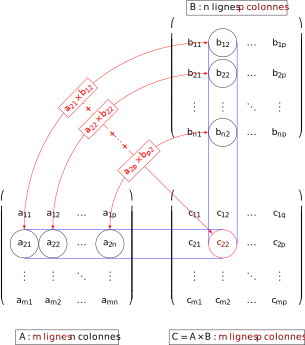
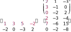

# Calcul matriciel

## Définitions et vocabulaire

%Dans tout ce chapitre, sauf indication contraire, $m$, $n$ , $p$, $i$ et $j$ désignent des entiers naturels non nuls.

::: warning Définition [Matrice]
Une **matrice** de **taille** $m\times n$ est un tableau de nombres formé de $m$ lignes et $n$ colonnes qui s’écrit sous la forme :

Le nombre $a_{ij}$ (avec $1\leqslant i \leqslant m$ et $1\leqslant j \leqslant n$) est situé dans la $i$-ième ligne et la $j$-ième colonne.

Il est appelé un **coefficient** de la matrice.
:::

::: tip Remarque 
En général, on note une matrice avec une lettre majuscule ou avec le coefficient général entre parenthèses, par exemple $(a_{ij})$.\\
Si $i>9$ ou $j>9$, on écrira par exemple $a_{1,11}$ et pas $a_{111}$ pour éviter la confusion avec $a_{11,1}$.
:::

::: tip Exemple 
Soit $A=(a_{ij})$ la matrice de taille $2\times3$ égale à  $\left(\begin{array}{ccc}
4 & 7 & -5 \\
3 & -1 & 8 \\
\end{array}\right)$ .\\
Le coefficient $a_{12}$  vaut $7$. Le coefficient $a_{21}$  vaut $3$.
:::

::: warning Définition [Matrice ligne, matrice colonne, matrice carrée]

+  Une matrice de taille $1\times n$ est appelée **matrice ligne** de taille $n$.

+  Une matrice  de taille $n\times 1$ est appelée **matrice colonne** de taille $n$.

+  Une matrice de taille $n\times n$ est appelée **matrice carrée** d'**ordre** $n$.

:::

::: tip Exemple 
$A=\begin{pmatrix}
4 & -2 & 1
\end{pmatrix}$, $B=\begin{pmatrix}
4 \\ -2
\end{pmatrix}$ et $C=\begin{pmatrix}
\cos \theta & -\sin \theta \\
\sin \theta & \cos \theta
\end{pmatrix}$ sont respectivement une matrice ligne de taille $3$, une matrice colonne de taille $2$ et une matrice carrée d'ordre $2$.
:::

::: warning Définition [Matrices égales]
Deux matrices $A=(a_{ij})$  et $B=(b_{ij})$  sont **égales** si elles ont la même taille $m\times n$ et si,
pour tout couple $(i;j)$ tel que $1\leqslant i \leqslant m$ et $1\leqslant j \leqslant n$, on a $a_{ij}=b_{ij}$.
:::

::: warning Définition [Matrice diagonale]
Une **matrice diagonale** $(a_{ij})$ est une matrice carrée dont les coefficients à l'extérieur
de la **diagonale principale**  sont nuls, c'est-à-dire tels que $a_{ij}=0$ pour $i\neq j$.

$\left(\begin{array}{cccc}
a_1    & 0      & \cdots & 0      \\
0      & a_2    & \ddots & \vdots \\
\vdots & \ddots & \ddots & 0      \\
0      & \cdots & 0      & a_n
\end{array}\right)$

:::

::: tip Remarque 
Une matrice diagonale  se note aussi $\boldsymbol{\text{diag}(a_1, a_2, \ldots, a_n)}$.\\
Dans une matrice diagonale, un ou plusieurs coefficients $a_{i}$ peuvent être  nuls.
:::

::: warning Définition [Matrice identité]
La matrice identité d'ordre $\boldsymbol{n}$, dont la diagonale principale ne contient que des $1$.
:::

::: tip Exemple 
L'identité d'ordre 3 est $I_3 = \begin{pmatrix}
1 & 0 & 0 \\
0 & 1 & 0 \\
0 & 0 & 1 \end{pmatrix}$. On peut aussi la noter $\mathrm{diag}(1, 1, 1)$.
:::

::: tip Remarque 
S'il n'y a pas d'ambiguïté, on note l'identité $I$ sans préciser son ordre en indice.
:::

::: warning Définition [Matrice transposée]
La **matrice transposée** d'une matrice $A$ de taille  $m\times n$ est la matrice notée $\boldsymbol{A^\mathsf{T}}$,
de taille  $n\times m$, obtenue en échangeant les lignes et les colonnes de $A$.
:::

::: tip Exemple 
$\begin{pmatrix}1 & 2 & 3 \\ 4 & 5 & 6\end{pmatrix}^\mathsf{T}=\begin{pmatrix}1 & 4 \\ 2 & 5\\ 3 & 6 \end{pmatrix}$  ; 
$\begin{pmatrix}1 & 2 \\ 3 & 4 \end{pmatrix}^\mathsf{T}=\begin{pmatrix}1 & 3 \\ 2 & 4 \end{pmatrix}$  ;  $\begin{pmatrix}0,3 & 0,7\end{pmatrix}^\mathsf{T}=\begin{pmatrix}0,3 \\ 0,7  \end{pmatrix}$.
:::

## Opérations sur les matrices

### Somme de deux matrices

::: warning Définition [Somme de deux matrices]
Soit $A=(a_{ij})$ et $B=(b_{ij})$ deux matrices de même taille $m\times n$.\\
La **somme** des matrices $A$ et $B$ est la matrice notée $A+B$ définie par :\\
$A+B=(c_{ij})$ avec $c_{ij}=a_{ij}+b_{ij}$ pour tout couple $(i;j)$ tel que $1\leqslant i\leqslant m$ et $1\leqslant j\leqslant n$.
:::

::: tip Exemple 
Soit $A=\begin{pmatrix}
-3 & 5  \\
-1 & 3  \\
\end{pmatrix}$ et $B=\begin{pmatrix}
2 & -5  \\
4 & 0  \\
\end{pmatrix}$. $A+B=\begin{pmatrix}
-3+2 & 5-5  \\
-1+4 & 3+0  \\
\end{pmatrix}=\begin{pmatrix}
-1 & 0  \\
3 & 3  \\
\end{pmatrix}$.
:::

%::: warning Définition [Matrice opposée]
%La **matrice opposée** d'une matrice $A$ est la matrice notée $-A$ dont les coefficients sont les opposés des coefficients de $A$.
%:::

::: warning Propriété 
Soit $A$, $B$, $C$ trois matrices de même taille.
\begin{colitemize}{2}

+  $A+B=B+A$ (commutativité)

+  $(A+B)+C=A+(B+C)$ (associativité)
\end{colitemize}
:::

::: warning Définition [Différence de deux matrices]
Soit $A$ et $B$ deux matrices de même taille.\\
La **différence** des matrices $A$ et $B$ est la matrice notée $A-B$ égale à la somme $A+(-B)$ où $-B$ est
la matrice **opposée** de $B$ dont les coefficients sont les opposés des coefficients de $B$.
:::

::: tip Exemple 
Soit $A=\begin{pmatrix}
-3 & 5  \\
-1 & 3  \\
\end{pmatrix}$ et $B=\begin{pmatrix}
2 & -5  \\
4 & 0  \\
\end{pmatrix}$.\\
$A-B=A+(-B)=
\begin{pmatrix}
-3 & 5  \\
-1 & 3  \\
\end{pmatrix}+\begin{pmatrix}
-2 & 5  \\
-4 & 0  \\
\end{pmatrix}=
\begin{pmatrix}
-3-2 & 5+5  \\
-1-4 & 3+0  \\
\end{pmatrix}=\begin{pmatrix}
-5 & 10  \\
-5 & 3  \\
\end{pmatrix}$.
:::

### Produit d'une matrice par un réel

::: warning Définition [Produit d'une matrice par un réel]
Soit $A$ une matrice et $k$ un nombre réel.\\
Le Produit d'une matrice par un réel de $A$ par le réel $k$ est la matrice notée $kA$ dont les coefficients sont obtenus en multipliant tous les coefficients de $A$ par $k$.
:::

::: tip Exemple 
$A=\begin{pmatrix}
3,5 & -5 & 2,5\\
-1 & 0,5 & -5,5
\end{pmatrix}$.\\
Alors, $-2A=\begin{pmatrix}
-2\times3,5 & -2\times(-5) & -2\times2,5\\
-2\times(-1) & -2\times0,5 & -2\times(-5,5)
\end{pmatrix}=\begin{pmatrix}
-7 & 10 & -5 \\
2 & -1 & 11  \\
\end{pmatrix}$.
:::

::: warning Propriété 
Soit $A$ et $B$ deux matrices de même taille et deux réels $k$ et $k'$.
\begin{colitemize}{2}

+  $0A=0$ et $1A=A$

+  $k(A+B)=kA+kB$

+  $(k+k')A=kA+k'A$

+  $(kk')A=k(k'A)$
\end{colitemize}
:::

::: tip Remarque 
Dans l'égalité $0A=0$, le $0$ de gauche est un réel mais celui de droite désigne la matrice nulle,
matrice ayant la même taille que $A$ et dont tous les coefficients sont nuls.
:::

### Produit de deux matrices

::: warning Définition [Produit d'une matrice ligne par une matrice colonne]
Le produit d'une matrice ligne par une matrice colonne de la matrice ligne $A=\begin{pmatrix}
a_1 &  \cdots & a_n
\end{pmatrix}$   par la matrice colonne \mbox{$B=\begin{pmatrix}
b_1\\ \vdots \\ b_n \end{pmatrix}$}  est noté $AB$ et est égal au réel $\displaystyle\sum_{i=1}^na_ib_i=a_1b_1+a_2b_2+\cdots+a_nb_n$.
:::

::: tip Exemple 
Soit $A=\begin{pmatrix}
3 & 0 & -2
\end{pmatrix}$ et $B=\begin{pmatrix}
-1\\ -4\\ -2 \end{pmatrix}$. $AB=3\times(-1)+0\times(-4)-2\times(-2)=1$.
:::

::: warning Définition [Produit de deux matrices]
Soit $A$ une matrice de taille $m\times n$ et $B$ une matrice de taille $n\times p$.\\
Le produit de deux matrices de $A$ par $B$, noté $AB$, est la matrice $C=(c_{ij})$ de taille $m\times p$ telle que $c_{ij}$ est égal au produit de la $i$-ième ligne de $A$ par la $j$-ième colonne de $B$.
:::

::: tip Remarques 

+  Le produit d'une matrice $A$ par une matrice $B$ n'existe qu'à condition que le nombre de colonnes de $A$ soit égale au nombre de lignes de $B$.

+  Si le produit d'une matrice $A$ par une matrice $B$ existe, en général, il n'est pas commutatif : en premier lieu, $BA$ n'existe pas toujours
(il n'existe que si $A$ et $B$ sont des matrices carrées) et, même si c'est le cas, généralement on n'a pas $AB=BA$.

:::

::: tip Méthode [Multiplier deux matrices]
Pour calculer la matrice $C$ égale à $AB$, on vérifie que le nombre de colonnes de $A$ est égal au nombre de lignes de $B$, puis on dispose
les matrices suivant le schéma

::: tip Exercice 
Soit
$A=\begin{pmatrix}
1 &  3 & 5 & -2 \\
-2 & 0 & -3 & 2
\end{pmatrix}$ et $B=\begin{pmatrix}
2 & 1  & -3 \\
3 &  -1 & 0 \\
0 & -2 & 2 \\
2 & -3 & -4
\end{pmatrix}$. Calculer $AB$.

::: tip Solution 

\begin{minipage}{0.5\linewidth}
$A$ est de taille $2\times4$ et $B$ de taille $4\times3$.\\
$A$ a autant de colonnes que $B$ a de lignes, donc $C=AB$ existe et sa taille est $2\times3$.\\
On dispose les matrices comme ci-contre.\\
On calcule alors, par exemple :\\
$c_{11}=\textcolor{B2}{\mathbf{1\times2+3\times3+5\times0-2\times2=7}}$.
\end{minipage}

\begin{minipage}{0.45\linewidth}

\end{minipage}
:::
:::
:::

::: tip Remarque 
Il n'est pas nécessaire que l'une des matrices $A$ ou $B$ soit nulle pour que $AB\!=\!0$.
:::

::: tip Exemple 
Soit $A=\begin{pmatrix}1 & -1 \\ 0 & 0\end{pmatrix}$ et $B=\begin{pmatrix}1 & 2 & 3 \\ 1 & 2 & 3\end{pmatrix}$. Alors, $AB=\begin{pmatrix}0 & 0 & 0 \\ 0 & 0 & 0\end{pmatrix}$.
:::

::: warning Propriétés 
Soit $A$, $B$ et $C$ trois matrices compatibles avec les produits écrits ci-après et soit $k$ un réel.

+  $(AB)C = A(BC) = ABC$ (associativité)

+  $A(B+C)=AB+AC$ et $(A+B)C=AC+BC$ (distributivité)

+  $(kA)B=A(kB)=k(AB)$

+  $AI=IA=A$ et $A0=0A=0$

:::

### Puissance d'une matrice carrée

::: warning Définition 
Soit $A$ une matrice carrée et $n$ un entier naturel.\\
La puissance $n$-ième de $A$ est la matrice notée $A^n$ égale :

+  au produit de $n$ facteurs $A$ si $n\neq0$ ;

+  à la matrice identité $I$ de même ordre que celui de $A$ si $n=0$.

:::

::: tip Exemple 
Soit $A=\begin{pmatrix}
2 & 0 \\
0 & -3
\end{pmatrix}$.
Alors, $A^0=\begin{pmatrix}
1 & 0 \\
0 & 1
\end{pmatrix}$ ; $A^2=\begin{pmatrix} 2 & 0 \\ 0 & -3 \end{pmatrix}\begin{pmatrix}  2 & 0 \\ 0 & -3 \end{pmatrix}=\begin{pmatrix}
4 & 0 \\
0 & 9
\end{pmatrix}$.\\
On peut démontrer par récurrence que, pout tout $n\in\mathbb{N}$,  $A^n=\begin{pmatrix}
2^n & 0 \\
0 & (-3)^n
\end{pmatrix}$.\\
:::

::: tip Méthode [Effectuer un calcul matriciel avec la calculatrice]

**Exercice:**

Soit
$A=\begin{pmatrix}
1 & -1 & 0 \\
0 & 1 & -1 \\
-1 & 0 & 1
\end{pmatrix}$ et $B=\begin{pmatrix}
3 & 2 & 1 \\
2 & 3 & 2 \\
1 & 2 & 3
\end{pmatrix}$. Calculer $A^2-2AB+B^2$.

**Correction**

\textcolor{H1}{\bfseries Avec une calculatrice TI % \raisebox{-1mm}{\includegraphics[height=4mm]{TI_logo.eps}}
}

+  Entrer dans le mode "Matrice"  puis le menu "EDIT".

+  Saisir la taille de la matrice $A$ puis ses coefficients. Pour les coefficients négatifs, utiliser la touche "(-)". Faire de même pour $B$.

+  Quitter le mode "Matrice" puis y entrer à nouveau et, dans le menu "NOMS", sélectionner la matrice \includegraphics[height=4mm]{TI_[A].eps}.
Compléter la formule et taper "Entrer".

\fbox{\includegraphics[height=2.cm]{TI_screenshot1.eps}}  \fbox{\includegraphics[height=2.cm]{TI_screenshot2.eps}}

\textcolor{H1}{\bfseries Avec une calculatrice \includegraphics[height=2mm]{CASIO_logo.eps}}

+  Entrer dans le menu "RUN-MAT" puis choisir \includegraphics[height=3mm]{CASIO_MAT.eps} (touche \touchecalc{F3}).

+  Saisir la taille de la matrice $A$ puis ses coefficients. Faire de même pour $B$.

+  Quitter \includegraphics[height=3mm]{CASIO_MAT.eps}, taper la formule en faisant précéder chaque nom de matrice par "Mat" (touches \touchecalc{SHIFT} puis \touchecalc{2}) : \includegraphics[height=3mm]{CASIO_screenshot2.eps}. Exécuter.

\fbox{\includegraphics[height=2.cm]{CASIO_screenshot1.eps}}
 \fbox{\includegraphics[height=2.cm]{CASIO_screenshot3.eps}}

:::

## Matrices inversibles

### Inverse d'une matrice carrée

::: warning Définition [Inverse d'une matrice carrée]
Une matrice carrée $A$ d’ordre $n$ est **inversible** s’il existe une matrice carrée $B$ d’ordre $n$ telle que $AB=BA=I$.\\
La matrice $B$, notée $\boldsymbol{A^{-1}}$, est appelée la
**matrice inverse** de $A$.
:::

::: tip Exemple {3.5pt}
Soit $A\hskip-.5mm=\hskip-.5mm\begin{pmatrix}
3 & 5 \\
4 & 7
\end{pmatrix}$ et $B\hskip-.5mm=\hskip-.5mm\begin{pmatrix}
7 & -5 \\
-4 & 3
\end{pmatrix}$. $AB\hskip-.5mm=\hskip-.5mmBA\hskip-.5mm=\hskip-.5mm\begin{pmatrix}
1 & 0 \\
0 & 1
\end{pmatrix}$ donc $B$ est l'inverse de $A$.
:::

::: warning Propriété 
Si une matrice est inversible, alors son inverse est unique.
:::

::: tip Preuve 
Soit $A$ une matrice inversible ayant deux inverses  $B$ et $C$.\\
On a $B=BI=B(AC)=(BA)C=IC=C$. Ainsi, $B=C$. Donc, l'inverse de $A$ est unique.
:::

::: warning Propriété 
Si $AB=I$, alors $A$ est inversible et $B=A^{-1}$.
:::

::: tip Remarque 
Il suffit donc  seulement  de vérifier l'une des égalités $AB=I$ ou $BA=I$ pour montrer que $A$ et $B$ sont inverses l'une de l'autre.
:::

::: tip Exemple 

Soit $A=\begin{pmatrix}
1 & 1  & 0\\
-2 & -1 & 0 \\
3 & -2 & 1
\end{pmatrix}$ et
$B=\begin{pmatrix}
-1 & -1 & 0 \\
2 & 1 & 0 \\
7 & 5 & 1
\end{pmatrix}$. Alors, $AB=\begin{pmatrix}
1 & 0 & 0\\
0 & 1 & 0 \\
0 & 0 & 1
\end{pmatrix}=I$.\\
Donc $A$ et $B$ sont inverses l'une de l'autre et on a les égalités $A^{-1}=B$ et $B^{-1}=A$.
:::

### Inverse d'une matrice carrée d'ordre 2

::: warning Définition [Déterminant d'une matrice carrée d'ordre 2]
Le **déterminant** de la matrice $M=\begin{pmatrix}
a & b \\
c & d
\end{pmatrix}$ est le réel noté $\det(M)$ ou $\begin{vmatrix}
a & b \\
c & d
\end{vmatrix}$ égal à $ad-bc$.
:::

::: warning Théorème [Inverse d'une matrice carrée d'ordre 2]
On prend $M \neq 0$.

+  La matrice $M=\begin{pmatrix}
a & b \\
c & d
\end{pmatrix}$  est inversible si, et seulement si, $ad-bc\neq0$.\\

+  Si $A$ est inversible, alors $A^{-1}=\dfrac{1}{ad-bc}\begin{pmatrix}
d & -b \\
-c & a
\end{pmatrix}=\dfrac{1}{\text{det}(A)}\begin{pmatrix}
d & -b \\
-c & a
\end{pmatrix}$.

:::

::: tip Preuve {3.5pt}
Soit $N=\begin{pmatrix}
d & -b \\
-c & a
\end{pmatrix}$. Alors,
$MN=\begin{pmatrix}
a & b \\
c & d
\end{pmatrix}
\begin{pmatrix}
d & -b \\
-c & a
\end{pmatrix}=
\begin{pmatrix}
ad-bc & 0 \\
0 & ad-bc
\end{pmatrix}
$.

+  Si $ad-bc\neq0$, alors $\dfrac{1}{ad-bc}MN=I\Leftrightarrow M\left(\dfrac{1}{ad-bc}N\right)=I$.\\
Donc $M$ est inversible et son inverse est $\dfrac{1}{ad-bc}N=\dfrac{1}{ad-bc}
\begin{pmatrix}
d & -b \\
-c & a
\end{pmatrix}$.

+  Si $ad-bc=0$, alors $MN=0$. Supposons alors que $M$ soit inversible, d'inverse $P$.\\
Alors, on aurait $PMN=IN=N$ et  $PMN=P0=0$ et donc $N=0$, ce qui est absurde car $M \neq 0$.

+  On a donc montré que si $ad-bc \neq 0$ alors $M$ est inversible, et si $ad-bd=0$ alors $M$ n'est pas inversible. On obtient donc l'équivalence demandée.

:::

::: tip Remarque 
Un peu logique: si $A$  et $B$ sont deux propositions, alors $(A \Rightarrow B) \iff (\text{non}(B) \Rightarrow \text{non}(A))$

En revenant à la démonstration prédente: notons $A$ la proposition "$ad-bc \neq 0$" et $B$ la proposition "$M$ est inversible"

On montre dans un premier temps que $A \Rightarrow B$

On montre ensuite que $\text{non}(A) \Rightarrow \text{non}(B)$, ce qui nous donne bien $B \Rightarrow A$.
:::

::: tip Remarques 

+  Toute matrice carrée admet un déterminant et un seul, mais pour un ordre strictement supérieur à 2,
il n'existe pas de formule simple pour le calculer et on utilisera une calculatrice ou un logiciel de calcul formel.

+  Le déterminant non nul est un critère d'inversibilité d'une matrice carrée de tout ordre.

:::

::: tip Exemple 
$A=\begin{pmatrix}
3 & 8 \\
2 & 6\end{pmatrix}$. Alors, $\det(A)=\begin{vmatrix}
3 & 8 \\
2 & 6
\end{vmatrix}=3\times6-2\times8=18-16=2\neq0$.\\
Ainsi, $A$ est inversible et $A^{-1}=\dfrac{1}{2}
\begin{pmatrix}
6 & -8 \\
-2 & 3\end{pmatrix}=\begin{pmatrix}
3 & -4 \\
-1 & 1,5\end{pmatrix}$.
:::

## Résolution d'un système linéaire

::: warning Propriété [Écriture matricielle d'un système]
Le système linéaire
$\left\{\begin{array}{ccc}
ax+by & = & c\\
a'x+b'y & = & c'
\end{array}\right.$
a pour écriture matricielle
$\begin{pmatrix}
a & b \\
a' & b'\end{pmatrix}\begin{pmatrix}
x  \\
y \end{pmatrix}=\begin{pmatrix}
c  \\
c' \end{pmatrix}$.
:::

::: tip Preuve 
$\begin{pmatrix}
a & b \\
a' & b'\end{pmatrix}\begin{pmatrix}
x  \\
y \end{pmatrix}=\begin{pmatrix}
c  \\
c' \end{pmatrix}
\Leftrightarrow
\begin{pmatrix}
ax+by \\
a'x+b'y\end{pmatrix}
=\begin{pmatrix}
c  \\
c' \end{pmatrix}
\Leftrightarrow
\left\{\begin{array}{ccc}
ax+by & = & c\\
a'x+b'y & = & c'
\end{array}\right.$.
:::

::: tip Remarque 
Cette propriété se généralise à un système  de dimension quelconque.
:::

::: tip Exemple 
$\begin{pmatrix}
2 & -3 & 1 \\
3 & -2 & -1 \end{pmatrix}\begin{pmatrix}
x  \\
y \\
z \end{pmatrix}=\begin{pmatrix}
7  \\
-5 \end{pmatrix}$ correspond au système
$\left\{\begin{array}{ccc}
2x-3y+z & = & 7\\
3x-2y-z & = & -5
\end{array}\right.$.
:::

::: warning Propriété 
Soit $A$ une matrice carrée inversible d'ordre $n$ et $B$ une matrice colonne de taille $n$.\\
Alors, le système linéaire d'écriture matricielle $AX=B$ admet une unique solution :\\
le $n$-uplet  correspondant à la matrice colonne $A^{-1}B$.
:::

::: tip Preuve 
Soit un système linéaire d'écriture matricielle $AX=B$ où $A$ est inversible.\\
Alors, on a  :
$AX=B \Leftrightarrow A^{-1}AX = A^{-1}B \Leftrightarrow
IX=A^{-1}B \Leftrightarrow X=A^{-1}B$.
:::

::: tip Méthode [Résoudre un système de deux équations à deux inconnues ]

**Exercice:**

Résoudre le système linéaire  $\left\{\begin{array}{lcc}
2x+5y & = & 8 \\
3x-4y & = & 15
\end{array}\right. $.

**Correction**

On résout l'équation $AX=B$ où
$A=\begin{pmatrix}
2 & 5 \\
3 & -4
\end{pmatrix}$, $X=\begin{pmatrix}
x \\
y
\end{pmatrix}$ et   $B=\begin{pmatrix}
8 \\
15
\end{pmatrix}$.\\
On calcule $\det(A)=-4\times2-3\times5=-23$. Comme $\det(A)\neq0$, alors $A$ est inversible.\\
Donc, l'équation $AX=B$ a pour unique solution $X=A^{-1}B$.\\
On calcule $X=\dfrac{-1}{23}\begin{pmatrix} -4 & -5 \\
-3 & 2
\end{pmatrix}\begin{pmatrix}
8 \\
15
\end{pmatrix}=\dfrac{-1}{23}\begin{pmatrix} -4\times8-5\times15 \\ -3\times8+2\times15\end{pmatrix}=\begin{pmatrix}107/23 \\ -6/23 \end{pmatrix}$.\\
Le système admet donc pour unique solution le couple $\left(\dfrac{107}{23};\dfrac{-6}{23}\right)$.
:::

::: tip Remarque 
Un système linéaire d'écriture matricielle $AX=B$ où $A$ n'est pas inversible a soit une infinité de solutions, soit aucune.
:::

::: tip Exemple 
Le système $\left\{\begin{array}{lcc}
3x+6y & = & a \\
4x+8y & = & b
\end{array}\right.$ s'écrit matriciellement $AX=B$ où $A=\begin{pmatrix}
3 & 6 \\
4 & 8
\end{pmatrix}$.\\
Or, $\det(A)=0$ donc $A$ n'est pas inversible.\\
Dans le système, multiplions l'équation du haut par 4 et celle du bas par 3. On obtient :\\
$\left\{\begin{array}{lcc}
12x+24y & = & 4a \\
12x+24y & = & 3b
\end{array}\right.$ ce qui entraîne que $4a=3b$ toujours vrai, ou jamais.
:::

