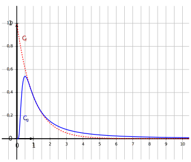

<ClientOnly>
  <ButtonBackToTop/>
</ClientOnly>

# Baccalauréat S -- Nouvelle Calédonie

27 novembre 2018

## Exercice 1

6 points

**Commun à tous les candidats**

Soient $f$ et $g$ les fonctions définies sur $]0;+\infty[$ par

$$ f(x)=e^{-x}\quad  \text{ et }\quad g(x) = \dfrac{1}{x^2} e^{-\frac{1}{x}}. $$

On admet que $f$ et $g$ sont dérivables sur $]0;+\infty[$. On note $f'$ et $g'$ leurs fonctions dérivées respectives.

Les représentations graphiques de $f$ et $g$ dans un repère orthogonal, nommées respectivement $\mathcal{C}_f$ et $\mathcal{C}_g$ sont données ci-dessous:

**Partie A -- Conjectures graphiques**

Dans chacune des questions de cette partie, aucune explication n'est demandée.

1.  Conjecturer graphiquement une solution de l'équation $f(x)=g(x)$ sur $]0;+\infty[$.

2)  Conjecturer graphiquement une solution de l'équation $g'(x)=0$ sur $]0;+\infty[$.

**Partie B -- Étude de la fonction $g$**

1.  Calculer la limite de $g(x)$ quand $x$ tend vers $+\infty$.

2)  On admet que la fonction $g$ est strictement positive sur $]0;+\infty[$.

Soit $h$ la fonction définie sur $]0;+\infty[$ par $h(x)=\ln\left ( g(x) \right )$.

a) Démontrer que, pour tout nombre réel $x$ strictement positif,

$$ h(x)= \dfrac{-1-2x\ln x}{x}. $$

b) Calculer la limite de $h(x)$ quand $x$ tend vers 0.

c) En déduire la limite de $g(x)$ quand $x$ tend vers 0.

3.  Démontrer que, pour tout nombre réel $x$ strictement positif,

$$ g'(x)= \dfrac{e^{-\frac{1}{x}}\left (1-2x \right )}{x^4}. $$

4.  En déduire les variations de la fonction $g$ sur $]0;+\infty[$.

**Partie C -- Aire des deux domaines compris entre les courbes $\mathcal{C}_f$ et $\mathcal{C}_g$**

1.  Démontrer que la point A de coordonnées $\left (1;e^{-1}\right )$ est un point d'intersection de $\mathcal{C}_f$ et $\mathcal{C}_g$.

On admet que ce point est l'unique point d'intersection de $\mathcal{C}_f$ et $\mathcal{C}_g$, et que $\mathcal{C}_f$ est au dessus de $\mathcal{C}_g$ sur l'intervalle $]0;1[$ et en dessous sur l'intervalle $]1;+\infty[$.

2.  Soient $a$ et $b$ deux réels strictement positifs. Démontrer que

$$ \displaystyle\int_{a}^{b} \left ( f(x)-g(x)\right ) d x = e^{-a} + e^{-\frac{1}{a}} - e^{-b} - e^{-\frac{1}{b}}. $$

3.  Démontrer que

$$ \displaystyle\lim_{a\to 0} \displaystyle\int_{a}^{1} \left ( f(x)-g(x)\right ) d x =1-2e^{-1}. $$

4.  On admet que

$$ \displaystyle\lim_{a\to 0} \displaystyle\int_{a}^{1} \left ( f(x)-g(x)\right ) d x =\displaystyle\lim_{b\to +\infty} \displaystyle\int_{1}^{b} \left ( g(x)-f(x)\right ) d x . $$

Interpréter graphiquement cette égalité.

## Exercice 2

3 points

**Commun à tous les candidats**

Une épreuve de culture générale consiste en un questionnaire à choix multiple (QCM) de vingt questions. Pour chacune d'entre elles, le sujet propose quatre réponses possibles, dont une seule est correcte. À chaque question, le candidat ou la candidate doit nécessairement choisir une seule réponse. Cette personne gagne un point par réponse correcte et ne perd auxun point si sa réponse est fausse.

On considère trois candidats

- a) Anselme répond complètement au hasard à chacune des vingt questions.

Autrement dit, pour chacune des questions, la probabilité qu'il réponde correctement est égale à $\dfrac{1}{4}$;

- b) Barbara est un peu mieux préparée. On considère que pour chacune des vingt questions, la probabilité qu'elle réponde correctement est de $\dfrac{1}{2}$;

* c) Camille fait encore mieux: pour chacune des questions, la probabilité qu'elle réponde correctement est de $\dfrac{2}{3}$.

1.  On note $X$, $Y$ et $Z$ les variables aléatoires égales aux notes respectivement obtenues par Anselme, Barbara et Camille.

a) Quelle est la loi de probabilité suivie par la variable aléatoire $X$? Justifier.

b) À l'aide de la calculatrice, donner l'arrondi au millième de la probabilité $P(X \geqslant 10)$.

Dans la suite, on admettra que $P(Y\geqslant 10) \approx 0,588$ et $P(Z\geqslant 10)\approx 0,962$.

1.  On choisit au hasard la copie d'un de ces trois candidats.

On note $A$, $B$, $C$ et $M$ les évènements:

- $A$: « la copie choisie est celle d'Anselme »;

* $B$: « la copie choisie est celle de Barbara »;

- $C$: « la copie choisie est celle de Camille »;

* $M$: « la copie choisie obtient une note supérieure ou égale à 10 ».

On constate, après l'avoir corrigée, que la copie choisie obtient une note supérieure ou égale à 10 sur 20.

Quelle est la probabilité qu'il s'agisse de la copie de Barbara?

On donnera l'arrondi au millième de cette probabilité.

## Exercice 3

6 points

**Commun à tous les candidats**

Soit ABCDEFGH le cube représenté ci-dessous.

On considère

- I et J les milieux respectifs des segments [AD] et [BC];

- P le centre de la face ABFE, c'est-à-dire l'intersection des diagonales (AF) et (BE);

- Q le milieu du segment [FG].

On se place dans le repère orthonormé $\left( \text{A};\frac{1}{2}\overrightarrow{AB}\;,\;\frac{1}{2}\overrightarrow{AD}\;,\;\frac{1}{2}\overrightarrow{AE}\right)$.

Dans tout l'exercice, on pourra utiliser les coordonnées des points de la figure sans les justifier.

On admet qu'une représentation paramétrique de la droite (IJ) est

$$\left\{
\begin{matrix}
x &= r\\
y &= 1\\
z &= 0\\
\end{matrix}
\right. , \quad r \in \R $$

1. Vérifier qu'une représentation paramétrique de la droite (PQ) est

$$\left\{
\begin{matrix}
x&= 1+t\\
y &= t \\
z &= 1+t\\
\end{matrix}
\right . ,\quad t\in\R $$

Soient $t$ un nombre réel et M\,$(1+t;t;1+t)$ le point de la droite (PQ) de paramètre $t$.

1. a) On admet qu'il existe un unique point K appartenant à la droite (IJ) tel que (MK) soit orthogonale à (IJ).

Démontrer que les coordonnées de ce point K sont $(1+t;1;0)$.

b) En déduire que $MK = \displaystyle\sqrt{2+2t^2}$.

1. a) Vérifier que $y-z=0$ est une équation cartésienne du plan (HGB).

b) On admet qu'il existe un unique point L appartenant au plan (HGB) tel que (ML) soit orthogonale à (HGB).

Vérifier que les coordonnées de ce point L sont $\left (1+t;\dfrac{1}{2}+t;\dfrac{1}{2}+t\right )$.

c) En déduire que la distance ML est indépendante de $t$.

3. Existe-t-il une valeur de $t$ pour laquelle la distance MK est égale à la distance ML?

## Exercice 4

5 points

**Candidats n'ayant pas suivi l'enseignement de spécialité**

On définit la suite de nombres complexes $(z_n)$ de la manière suivante: $z_0=1$ et, pour tout entier naturel $n$,

$$ z_{n+1} = \dfrac{1}{3} z_{n} + \dfrac{2}{3}i. $$

On se place dans un plan muni d'un repère orthonormé direct (O; $\vec{u}$, $\vec{v}$).

Pour tout entier naturel $n$, on note A$_{n}$ le point du plan d'affixe $z_n$.

Pour tout entier naturel $n$, on pose $u_n=z_n-i$ et on note B$_n$ le point d'affixe $u_n$.

On note C le point d'affixe $i$.

1. Exprimer $u_{n+1}$ en fonction de $u_n$, pour tout entier naturel $n$.

2. Démontrer que, pour tout entier naturel $n$,

$$ u_n=\left (\dfrac{1}{3}\right )^{n} \left (1-i\right ). $$

3. a) Pour tout entier naturel $n$, calculer, en fonction de $n$, le module de $u_n$.

b) Démontrer que

$$ \lim_{n\to +\infty} \left |z_n-i \right |=0. $$

c) Quelle interprétation géométrique peut-on donner de ce résultat?

4. a) Soit $n$ un entier naturel. déterminer un argument de $u_n$.

b) Démontrer que, lorsque $n$ décrit l'ensemble des entiers naturels, les points B$_n$ sont alignés.

c) Démontrer que, pour tout entier naturel $n$, le point A$_n$ appartient à la droite d'équation réduite:

$$ y=-x+1. $$

## Exercice 4

5 points

**Candidats ayant suivi l'enseignement de spécialité**

On appelle suite de Fibonacci la suite $(u_n)$ définie par $u_0=0$, $u_1=1$ et, pour tout entier naturel $n$,

$$ u_{n+2} = u_{n+1} + u_{n}. $$

On admet que, pour tout entier naturel $n$, $u_n$ est un entier naturel.

_Les parties _A_ et _B_ peuvent être traitées de façon indépendante._

**Partie A**

1.

a) Calculer les termes de la suite de Fibonacci jusqu'à $u_{10}$.

b) Que peut-on conjecturer sur le PGCD de $u_{n}$ et $u_{n+1}$ pour tout entier naturel $n$?

2. On définit la suite $(v_n)$ par $v_n=u_n^2 - u_{n+1}\times u_{n-1}$ pour tout entier naturel $n$ non nul.

a) Démontrer que, pour tout entier naturel $n$ non nul, $v_{n+1} = -v_n$.

b) En déduire que, pour tout entier naturel $n$ non nul,

$$ u_n^2 - u_{n+1}\times u_{n-1} = \left (-1\right )^{n-1}. $$

c) Démontrer alors la conjecture émise à la question **1. b.**

**Partie B**

On considère la matrice
$F=\begin{pmatrix} 1 & 1 \\ 1 & 0\end{pmatrix}$.

1. Calculer $F^2$ et $F^3$. On pourra utiliser la calculatrice.

2.  Démontrer par récurrence que, pour tout entier naturel $n$ non nul,

$$ F^n = \begin{pmatrix} u_{n+1} & u_n \\ u_n & u_{n-1} \end{pmatrix} $$

3.

a) Soit $n$ un entier naturel non nul. En remarquant que
$F^{2n+2} = F^{n+2}\times F^{n}$, démontrer que

$$ u_{2n+2} =u_{n+2}\times u_{n+1}+ u_{n+1}\times u_n. $$

b) En déduire que, pour tout entier naturel $n$ non nul,

$$ u_{2n+2} = u_{n+2}^2 - u_n^2. $$

4. On donne $u_{12}=144$.

Démontrer en utilisant la question **3.** qu'il existe un triangle rectangle dont les longueurs des côtés sont toutes des nombres entiers, l'une étant égale à 12.

Donner la longueur des deux autres côtés.
