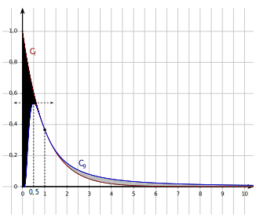

# Corrigé du baccalauréat S -- Nouvelle Calédonie
27 novembre 2018

## Exercice 1
  6 points

**Commun à tous les candidats**

Soient $f$ et $g$ les fonctions définies sur $]0;+\infty[$ par
$f(x)=e^{-x}$ et $g(x) = \dfrac{1}{x^2} e^{-\frac{1}{x}}$.

On admet que $f$ et $g$ sont dérivables sur $]0;+\infty[$. On note $f'$ et $g'$ leurs fonctions dérivées respectives.
Les représentations graphiques de $f$ et $g$ dans un repère orthogonal, nommées respectivement $\mathcal{C}_f$ et $\mathcal{C}_g$ sont données ci-dessous:

**Partie A -- Conjectures graphiques**

1.  D'après le graphique, on peut dire qu'une solution de l'équation $f(x)=g(x)$ sur $]0;+\infty[$ est $x=1$.

2.  D'après le graphique, on peut dire qu'une solution de l'équation $g'(x)=0$ sur $]0;+\infty[$ est $x=0,5$.

**Partie B -- Étude de la fonction $g$**

1.  On cherche la limite de $g(x)$ quand $x$ tend vers $+\infty$.

$$\left .
\begin{array}{l}
\displaystyle\lim_{x\to +\infty} \dfrac{1}{x^2}=0\\
\left .
\begin{array}{l}
\displaystyle\lim_{x\to +\infty} -\dfrac{1}{x} = 0\\
\displaystyle\lim_{X\to 0} e^{X} = 1\\
\end{array}
\right \rbrace
\text{ donc }
\displaystyle\lim_{x\to +\infty} e^{-\frac{1}{x}}=1
\end{array}
\right \rbrace$$
donc
$\displaystyle\lim_{x\to +\infty} \dfrac{1}{x^2} e^{-\frac{1}{x}}=0$

On peut donc dire que $\displaystyle\lim_{x\to +\infty} g(x)=0$.

1.  On admet que la fonction $g$ est strictement positive sur $]0;+\infty[$.

Soit $h$ la fonction définie sur $]0;+\infty[$ par $h(x)=\ln\left ( g(x) \right )$.

a)  Pour tout nombre réel $x$ strictement positif,

$h(x)=  \ln\left ( g(x) \right )$

$= \ln\left (  \dfrac{1}{x^2} e^{-\frac{1}{x}}\right )$

$= \ln\left (\dfrac{1}{x^2}\right ) +  \ln\left ( e^{-\frac{1}{x}} \right )$

$= -\ln\left (x^2 \right ) -\dfrac{1}{x}$

$= -2 \ln x  - \dfrac{1}{x}$

$= \dfrac{-1-2x\ln x}{x}$.

b)  On calcule la limite de $h(x)$ quand $x$ tend vers 0.

On sait que $\displaystyle\lim_{x\to 0} x \ln x = 0$.
On en déduit que 

$\displaystyle\lim_{x\to 0} \left (-1-2x \ln x\right ) = -1$ et donc que
$\displaystyle\lim_{x\to 0} \dfrac{-1-2x\ln x}{x} = -\infty$, c'est-à-dire
$\displaystyle\lim_{x\to 0} h(x)= -\infty$.

c) 
Pour tout $x>0$, $h(x)=\ln\left (g(x)\right )$ donc $g(x) = e^{h(x)}$.

$$\left.
\begin{array}{l}
\displaystyle\lim_{x\to 0} h(x) = -\infty\\
\displaystyle\lim_{X\to -\infty} e^{X} = 0\\
\end{array}
\right \rbrace$$
donc
$$\displaystyle\lim_{x\to 0} e^{h(x)}=0$$
ce qui veut dire que
$\displaystyle\lim_{x\to 0} g(x)=0$.

1. 
Pour tout $x>0$, la dérivée de la fonction $x \mapsto \dfrac{1}{x}$ est $x \mapsto -\dfrac{1}{	x^2}$.

Pour tout $x>0$, la dérivée de la fonction $x \mapsto \dfrac{1}{x^2}$ est $x \mapsto -\dfrac{-2x}{x^4}$.

Pour tout $x>0$, la dérivée de la fonction $x \mapsto e^{-\frac{1}{x}}$ est $x \mapsto \dfrac{1}{x^2}e^{-\frac{1}{x}}$.

Donc pour tout $x>0$,
$g'(x) = \left ( -\dfrac{2x}{x^4}\right ) \times e^{-\frac{1}{x}} + \dfrac{1}{x^2}\times \left ( \dfrac{1}{x^2} e^{-\frac{1}{x}}\right )
= \dfrac{e^{-\frac{1}{x}}\left (1-2x \right )}{x^4}$.

1.  Sur $]0;+\infty[$, $x^4>0$ et $e^{-\frac{1}{x}}>0$ donc $g'(x)$ est du signe de $1-2x$:

+  la fonction $g$ est strictement croissante sur $]0;0,5]$;

+  la fonction $g$ est strictement décroissante sur $[0,5;+\infty[$.
\end{list}

**Partie C -- Aire des deux domaines compris entre les courbes $\mathcal{C}_f$ et $\mathcal{C}_g$**

1. 
Soit A le point de coordonnées $\left (1;e^{-1}\right )$.

$f(x_{\text{A}})=f(1) = e^{-1} = y_{\text{A}}$ donc le point A appartient à la courbe $\mathcal{C}_f$.

$g(x_{\text{A}})=g(1) = \dfrac{1}{1^2}e^{-\frac{1}{1}} = e^{-1} = y_{\text{A}}$ donc le point A appartient à la courbe $\mathcal{C}_g$.

Donc le point A est un point d'intersection des courbes $\mathcal{C}_f$ et $\mathcal{C}_g$.

On admet que ce point est l'unique point d'intersection de $\mathcal{C}_f$ et $\mathcal{C}_g$, et que $\mathcal{C}_f$ est au dessus de $\mathcal{C}_g$ sur l'intervalle $]0;1[$ et en dessous sur l'intervalle $]1;+\infty[$.

1.  Soient $a$ et $b$ deux réels strictement positifs. 

La fonction $f$ définie par $f(x)=e^{-x}$ a pour primitive la fonction $x \mapsto -e^{-x}$.

La fonction $g$ est définie par $g(x)= \dfrac{1}{x^2} e^{-\frac{1}{x}}$ de la forme $u'(x)e^{u(x)}$ d'après ce qui a été vu précédemment; elle a donc pour primitive la fonction $x \mapsto e^{u(x)}$ c'est-à-dire $x\mapsto e^{-\frac{1}{x}}$.

La fonction $\left (f-g\right )$ a donc pour primitive la fonction $x\mapsto -e^{-x} - e^{-\frac{1}{x}}$.

On en déduit que

$\displaystyle\int_{a}^{b} \left ( f(x)-g(x)\right ) d x= \left [ -e^{-x} - e^{-\frac{1}{x}} \right ]_{a}^{b}$

$=  - e^{-b} - e^{-\frac{1}{b}} - \left ( -e^{-a} - e^{-\frac{1}{a}} \right )$
$= e^{-a} + e^{-\frac{1}{a}} - e^{-b} - e^{-\frac{1}{b}}$

1.  
D'après la question précédente,

$\displaystyle\int_{a}^{1} \left ( f(x)-g(x)\right ) d x  = e^{-a} + e^{-\frac{1}{a}} - e^{-1} -e^{\frac{-1}{1}}
= e^{-a} + e^{-\frac{1}{a}} - 2e^{-1}$.

$\displaystyle\lim_{a\to 0} e^{-a} = e^{0}=1$

$$\left.
\begin{matrix}
\displaystyle\lim_{a\to 0} -\dfrac{1}{a} = -\infty\\
\displaystyle\lim_{X\to -\infty} e^{X} = 0\\
\end{matrix}
\right\}$$ 
donc
$\displaystyle\lim_{a\to 0} e^{-\frac{1}{a}} = 0$

On peut donc déduire que
$\displaystyle\lim_{a\to 0}  e^{-a} + e^{-\frac{1}{a}} = 1$
et donc que
$\displaystyle\lim_{a\to 0} \displaystyle\int_{a}^{1} \left ( f(x)-g(x)\right ) d x =1-2e^{-1}$.

1.  On admet que
$\displaystyle\lim_{a\to 0} \displaystyle\int_{a}^{1} \left ( f(x)-g(x)\right ) d x =\displaystyle\lim_{b\to +\infty} \displaystyle\int_{1}^{b} \left ( g(x)-f(x)\right ) d x .$

Sur l'intervalle $]0;1[$, la courbe $\mathcal{C}_f$ est au dessus de la courbe $\mathcal{C}_g$ donc $\displaystyle\lim_{ a\to 0} \displaystyle\int_{a}^{1} \left( f(x)-g(x)\right) dx$ représente l'aire de la partie du plan comprise entre les courbes $\mathcal{C}_f$ et $\mathcal{C}_g$, et les droites d'équation $x=0$ et $x=1$. 

C'est l'aire de la région hachurée sur le graphique.

Sur l'intervalle $]1;+\infty[$, la courbe $\mathcal{C}_g$ est au dessus de la courbe $\mathcal{C}_f$ donc
$$\displaystyle\lim_{b\to +\infty} \displaystyle\int_{1}^{b} \left ( g(x)-f(x)\right ) d x $$ 
représente l'aire de la partie du plan comprise entre les courbes $\mathcal{C}_g$ et $\mathcal{C}_f$, et les droites $x=1$ et $x=b$ quand $b$ tend vers $+\infty$. \\
C'est l'aire de la région grisée sur le graphique.

On peut donc dire que ces deux aires sont égales.

## Exercice 2  
3 points

**Commun à tous les candidats**

Une épreuve de culture générale consiste en un questionnaire à choix multiple (QCM) de vingt questions. Pour chacune d'entre elles, le sujet propose quatre réponses possibles, dont une seule est correcte. À chaque question, le candidat ou la candidate doit nécessairement choisir une seule réponse. Cette personne gagne un point par réponse correcte et ne perd auxun point si sa réponse est fausse.

On considère trois candidats:
+ Anselme répond complètement au hasard à chacune des vingt questions.

Autrement dit, pour chacune des questions, la probabilité qu'il réponde correctement est égale à $\dfrac{1}{4}$;
+ Barbara est un peu mieux préparée. On considère que pour chacune des vingt questions, la probabilité qu'elle réponde correctement est de $\dfrac{1}{2}$;
+ Camille fait encore mieux: pour chacune des questions, la probabilité qu'elle réponde correctement est de $\dfrac{2}{3}$.

1.  On note $X$, $Y$ et $Z$ les variables aléatoires égales aux notes respectivement obtenues par Anselme, Barbara et Camille.

a)  
Anselme répond au hasard à chaque question donc il a une probabilité de répondre juste à une question de $p=\dfrac{1}{4}$.

Il y a 20 questions qui sont indépendantes donc la variable aléatoire $X$ qui donne le nombre de bonnes réponses d'Anselme, donc sa note, suit la loi binomiale de paramètres $n=20$ et $p=0,25$.

b)  À l'aide de la calculatrice, l'arrondi au millième de la probabilité $P(X \geqslant 10)$ est $0,014$.

Dans la suite, on admettra que $P(Y\geqslant 10) \approx 0,588$ et $P(Z\geqslant 10)\approx 0,962$.

1.  On choisit au hasard la copie d'un de ces trois candidats.

On note $A$, $B$, $C$ et $M$ les événements:

+  $A$:  «  la copie choisie est celle d'Anselme  » ;

+  $B$:  «  la copie choisie est celle de Barbara  » ;

+  $C$:  «  la copie choisie est celle de Camille  » ;

+  $M$:  «  la copie choisie obtient une note supérieure ou égale à 10  » .

On constate, après l'avoir corrigée, que la copie choisie obtient une note supérieure ou égale à 10 sur 20.

La probabilité qu'il s'agisse de la copie de Barbara est $P_{M}(B)$ soit $\dfrac{P\left (B\cap M\right )}{P(M)}$.

+  On choisit au hasard la copie d'un des trois candidats donc
$P(A)=P(B)=P(C)=\dfrac{1}{3}$.

+  $P(B \cap M) = P(B) \times P_{B}(M)$.

D'après le contexte, $P_{B}(M) = P(Y\geqslant 10)$ donc $P(B \cap M) = \dfrac{1}{3}\times 0,588$.

+  D'après la formule des probabilités totales

$P(M)= P(A\cap M) + P(B\cap M) + P(C\cap M)$

$= P(A)\times P_{A}(M) + P(B)\times P_{B}(M) + P(C)\times P_{C}(M)$

$= P(A)\times P(X\geqslant 10) + P(B)\times P(Y\geqslant 10) + P(C)\times P(Z\geqslant 10)$

$= \dfrac{1}{3} \times 0,014 + \dfrac{1}{3}\times 0,588 + \dfrac{1}{3}\times 0,962$

$= \dfrac{1,564}{3}$

Donc $P_{M}(B) = \dfrac{\frac{0.588}{3}}{\frac{1,564}{3}}$ dont l'arrondi au millième est $0,376$.

## Exercice 3
  6 points

**Commun à tous les candidats**

Soit ABCDEFGH le cube représenté ci-dessous.

On considère:
+ I et J les milieux respectifs des segments [AD] et [BC];
+ P le centre de la face ABFE, c'est-à-dire l'intersection des diagonales (AF) et (BE);
+ Q le milieu du segment [FG].

On se place dans le repère orthonormé $\left ( \text{A};\frac{1}{2}\overrightarrow{AB}\;,\;\frac{1}{2}\overrightarrow{AD}\;,\;\frac{1}{2}\overrightarrow{AE}\right )$.

Dans tout l'exercice, on pourra utiliser les coordonnées des points de la figure sans les justifier.

Ces points ont pour coordonnées:

A$(0;0;0)$; B$(2;0;0)$; D$(0;2;0)$; E$(0;0;2)$;
C$(2;2;0)$; F$(2;0;2)$; H$(0;2;2)$; G$(2;2;2)$;
I$(0;1;0)$; J$(2;1;0)$; P$(1;0;1)$ et Q$(2;1;2)$

On admet qu'une représentation paramétrique de la droite (IJ) est
$$\left \lbrace
\begin{array}{ll}
x&= r\\
y &=1\\
z &= 0\\
\end{array}
\right . , \quad r\in\R$$

1. 
La droite (PQ) est l'ensemble des points M$(x;y;z)$ tels que les vecteurs $\overrightarrow{PM}$ et $\overrightarrow{PQ}$ soient colinéaires, c'est-à-dire tels que $\overrightarrow{PM} = t.\overrightarrow{PQ}$ avec $t\in\R$.

$\overrightarrow{PM}$ a pour coordonnées $(x-1;y;z-1)$ et $\overrightarrow{PQ}$ a pour coordonnées $(2-1;1-0;2-1)=(1;1;1)$

$$\overrightarrow{PM} = t.\overrightarrow{PQ}
\iff
\left \lbrace
\begin{matrix}
x-1&= t\times 1\\
y &= t\times 1 \\
z-1 &= t\times 1\\
\end{matrix}
\right .
\iff
\left \lbrace
\begin{array}{ll}
x&= 1+ t\\
y &= t \\
z &= 1+t\\
\end{array}
\right .$$

La droite (PQ) a pour représentation paramétrique

$$\left\{
\begin{matrix}
x &= 1+t\\
y &= t \\
z &= 1+t\\
\end{matrix}
\right. ,\quad t\in\R$$

Soient $t$ un nombre réel et M\,$(1+t;t;1+t)$ le point de la droite (PQ) de paramètre $t$.

1. 

a)  On admet qu'il existe un unique point K appartenant à la droite (IJ) tel que (MK) soit orthogonale à (IJ).

%Démontrer que les coordonnées de ce point K sont $(1+t;1;0)$.

Le point K appartient à la droite (IJ) dont on connait une représentation paramétrique donc les coordonnées de K sont de la forme $(r;1;0)$.

Les droites (IJ) et (MK) sont orthogonales donc les vecteurs $\overrightarrow{IJ}$ et $\overrightarrow{MK}$ sont orthogonaux; leur produit scalaire est donc nul.

$\overrightarrow{IJ}$ a pour coordonnées $(2-0;1-1;0-0) = (2;0;0)$, et $\overrightarrow{MK}$ a pour coordonnées $(x_K - x_M ;y_K - y_M;z_{\text K} - z_{\text M})=(r-1-t;1-t;-1-t)$.

$\overrightarrow{IJ}.\overrightarrow{MK}=0
\iff
2(r-1-t)+0(1-t) + 0(-1-t) = 0 \iff r=1+t$

Le point K a donc pour coordonnées $(1+t;1;0)$.

b) 
D'après la question précédente, le vecteur $\overrightarrow{MK}$ a pour coordonnées
$(0;1-t;-1-t)$ donc
$\text{MK} = \displaystyle\sqrt{0^2 + (1-t)^2+ (-1-t)^2}
= \displaystyle\sqrt{1-2t+t^2+1+2t+t^2} = \displaystyle\sqrt{2+2t^2}$.

1. 

a)  Les trois points H, G et B ne sont pas alignés donc ils définissent le plan (HGB).

Soit $\mathcal{P}$ le plan d'équation $y-z=0$.

$y_{\text H} -z_{\text H} = 2-2=0$ donc le point H appartient au plan $\mathcal{P}$.

$y_{\text G} -z_{\text G} = 2-2=0$ donc le point G appartient au plan $\mathcal{P}$.

$y_{\text B} -z_{\text B} = 0-0=0$ donc le point B appartient au plan $\mathcal{P}$.

Le plan $\mathcal{P}$ est donc le plan (HGB) ce qui veut dire que le plan (HGB) a pour équation cartésienne $y-z=0$.

b)  On admet qu'il existe un unique point L appartenant au plan (HGB) tel que (ML) soit orthogonale à (HGB).

On suppose que  le point L a pour coordonnées $\left (1+t;\dfrac{1}{2}+t;\dfrac{1}{2}+t\right )$.

+  $y_{\text L} - z_{\text L} = \dfrac{1}{2}+t - \left ( \dfrac{1}{2}+t\right ) = 0$ donc $\text L \in \text{(HGB)}$.

+  Le vecteur $\overrightarrow{ML}$ a pour coordonnées\\
$(1+t -\left (1+t \right );\dfrac{1}{2}+t-t;\dfrac{1}{2}+t- \left ( 1+t\right ))=(0;\dfrac{1}{2};-\dfrac{1}{2}$.

+  Le vecteur $\overrightarrow{HG}$ a pour coordonnées $(2-0;2-2;2-2) = (2;0;0)$.

$\overrightarrow{ML}.\overrightarrow{HG} = 0\times 2 + \dfrac{1}{2}\times 0 + \left (-\dfrac{1}{2}\right )\times 0 = 0$ donc $\overrightarrow{ML}\perp \overrightarrow{HG}$.

+  Le vecteur $\overrightarrow{HB}$ a pour coordonnées $(2-0;0-2;0-2) = (2;-2;-2)$.

$\overrightarrow{ML}.\overrightarrow{HB} = 0\times 2 + \dfrac{1}{2}\times (-2) + \left (-\dfrac{1}{2}\right )\times 2 = 0-1+1 = 0$ donc $\overrightarrow{ML}\perp \overrightarrow{HB}$.

Le vecteur $\overrightarrow{ML}$ est orthogonal à deux vecteurs $\overrightarrow{HG}$ et $\overrightarrow{HB}$ non colinéaires, donc le  vecteur $\overrightarrow{ML}$ est orthogonal au plan (HGB).

Si L a pour coordonnées $\left (1+t;\dfrac{1}{2}+t;\dfrac{1}{2}+t\right )$, alors L appartient au plan (HGB) et la droite (ML) est orthogonale au plan (HGB).

g)  
Le vecteur $\overrightarrow{ML}$ a pour coordonnées $(0;\dfrac{1}{2};-\dfrac{1}{2})$; ces coordonnées ne dépendent pas de $t$ donc la distance ML ne dépend pas de $t$.

$\text{ML} = \displaystyle\sqrt{0^2 + \left (\dfrac{1}{2}\right )^2 + \left ( -\dfrac{1}{2}\right )^2}
= \displaystyle\sqrt{\dfrac{1}{4}+\dfrac{1}{4}}= \displaystyle\sqrt{\dfrac{1}{2}} = \displaystyle\dfrac{\sqrt{2}}{2}$

1.  
La distance MK est égale à ML si et seulement si
$\displaystyle\sqrt{2+2t^2} = \displaystyle\sqrt{\dfrac{1}{2}}$
ce qui équivaut à
$2+2t^2 = \dfrac{1}{2}$ ou encore $2t^2 = -\dfrac{3}{2}$.

L'équation $2t^2 = -\dfrac{3}{2\rule[-3pt]{0pt}{0pt}}$ n'a pas de solution donc il n'existe pas de valeur de $t$ pour laquelle les distances MK et ML sont égales.

**Exercice 4  5 points**

**Candidats n'ayant pas suivi l'enseignement de spécialité**

On définit la suite de nombres complexes $(z_n)$ de la manière suivante: $z_0=1$ et, pour tout entier naturel $n$,
$z_{n+1} = \dfrac{1}{3} z_{n} + \dfrac{2}{3}i.$

On se place dans un plan muni d'un repère orthonormé direct (O; $\vec{u}$, $\vec{v}$).

Pour tout entier naturel $n$, on note A$_{n}$ le point du plan d'affixe $z_n$.

Pour tout entier naturel $n$, on pose $u_n=z_n-i$ et on note B$_n$ le point d'affixe $u_n$.

On note C le point d'affixe $i$.

1.  De $u_n=z_n-i$, on  déduit que $z_n=u_n+i$.

$u_{n+1}= z_{n+1} -i = \dfrac{1}{3} z_n +\dfrac{2}{3}i - i
= \dfrac{1}{3} \left ( u_n+i \right ) -\dfrac{1}{3}i
= \dfrac{1}{3} u_n + \dfrac{1}{3}i - \dfrac{1}{3}i
= \dfrac{1}{3} u_n$

1. 
La suite $(u_n)$ est géométrique de raison $q=\dfrac{1}{3}$ et de premier terme $u_0=v_0 -i = 1-i$.

On a donc, pour tout $n$, $u_n=u_0\times q^n = \left (1-i\right ) \left (\dfrac{1}{3} \right )^n$.

3. 

a)  Pour tout entier naturel $n$, 
$\left |u_n\right | = \left | \left (\dfrac{1}{3}\right )^n\left (1-i\right )\right | = \left (\dfrac{1}{3}\right )^n \left |1-i\right |
= \left (\dfrac{1}{3}\right )^n \displaystyle\sqrt{1^2 + (-1)^2}
= \displaystyle\sqrt{2}\left (\dfrac{1}{3}\right )^n$.

b)  
$\left |z_n-i \right | = \left |u_n \right | = \displaystyle\sqrt{2}\left (\dfrac{1}{3}\right )^n$

Or $-1<\dfrac{1}{3} < \dfrac{1}{3}$, donc $\displaystyle\lim_{n \to +\infty} \left (\dfrac{1}{3} \right )^n =0$ donc
$\displaystyle\lim_{n\to +\infty} \left |z_n-i \right |=0$.

c) 
$z_n$ est l'affixe du point A$_n$, et $i$ est l'affixe du point C; donc $\left |z_n-i \right |=\text{A}_n\text{C}$.

$\displaystyle\lim_{n\to +\infty} \left |z_n-i \right |=0$ signifie que $\displaystyle\lim_{n\to +\infty} \text{A}_n\text{C}=0$ ce qui veut dire que, lorsque $n$ tend vers $+\infty$, le point A$_n$ tend vers le point C.

1. 

a)  Soit $n$ un entier naturel.

$u_n=\left (\dfrac{1}{3}\right )^n\left (1-i\right )$ donc $\arg(u_n)=\arg\left (1-i\right )$

$1-i =\displaystyle\sqrt{2}\left (\dfrac{\displaystyle\sqrt{2}}{2} - i\dfrac{\displaystyle\sqrt{2}}{2} \right ) =
\displaystyle\sqrt{2} \left ( \cos\left (-\dfrac{\pi}{4}\right ) + i \sin\left (-\dfrac{\pi}{4}\right )\right )$ donc
$1-i$ a pour argument $-\dfrac{\pi}{4}$.

On en déduit que $\arg(u_n)=-\dfrac{\pi}{4} + k2\pi$ avec $k$ entier relatif.

b) 
Les points B$_n$ ont pour affixes les nombres $u_n$ dont l'argument est constant à $2\pi$ près. Pour tout $n$, chaque point B$_n$ appartient à la droite d'équation $y=-x$; donc tous les points B$_n$ sont alignés.

c) 

$z_n=u_n+i = \left (\dfrac{1}{3}\right )^n \left (1-i\right ) + i
= \left (\dfrac{1}{3}\right )^n + \left ( 1-\left( \dfrac{1}{3}\right )^n\right  ) i$

Soit $x$ la partie réelle de $z_n$ et $y$ sa partie ima2ginaire.

$x=\left (\dfrac{1}{3}\right )^n$ et $y=1-\left (\dfrac{1}{3}\right )^n$ donc $y=1-x$.

On en déduit que $y=-x+1$ et donc que le point A$_n$ d'affixe $z_n$ appartient à la droite d'équation $y=-x+1$.

**Exercice 4  5 points**

**Candidats ayant suivi l'enseignement de spécialité**

On appelle suite de Fibonacci la suite $(u_n)$ définie par $u_0=0$, $u_1=1$ et, pour tout entier naturel $n$,
$u_{n+2} = u_{n+1} + u_{n}.$

On admet que, pour tout entier naturel $n$, $u_n$ est un entier naturel.

**Partie A**

1. 

a)  On calcule les termes de la suite de Fibonacci jusqu'à $u_{10}$:

$$\begin{matrix}
n &0 & 1 & 2 & 3 & 4 & 5 & 6 & 7 & 8 & 9 & 10\\

u_n & 0 & 1 & 0+1 = 1 & 1+1 = 2 & 1+2 = 3 & 2+3= 5 & 3+5= 8  & 5+8 = 13 & 8+13 = 21 & 13+21 = 34 & 21+34 = 55 \\
\end{matrix}$$

b)  
$\text{PGCD}(u_0,u_1) = \text{PGCD}(0,1) = 1$

$\text{PGCD}(u_1,u_2) = \text{PGCD}(1,1) = 1$

$\text{PGCD}(u_2,u_3) = \text{PGCD}(1,2) = 1$

$\text{PGCD}(u_3,u_4) = \text{PGCD}(2,3) = 1$

$\text{PGCD}(u_4,u_5) = \text{PGCD}(3,5) = 1$

$\text{PGCD}(u_5,u_6) = \text{PGCD}(5,8) = 1$

$\text{PGCD}(u_6,u_7) = \text{PGCD}(8,13) = 1$ car 13 est un nombre premier.

$\text{PGCD}(u_7,u_8) = \text{PGCD}(13,21) = 1$ car 13 est un nombre premier.

$\text{PGCD}(u_8,u_9) = \text{PGCD}(21,34) = 1$ car $21=3\times 7$ et $34=2\times 17$.

$\text{PGCD}(u_9,u_{10}) = \text{PGCD}(34,55) = 1$  $34=2\times 17$ et $55=5\times 11$.

On peut conjecturer que le PGCD de $u_{n}$ et $u_{n+1}$ est 1.

1.  On définit la suite $(v_n)$ par $v_n=u_n^2 - u_{n+1}\times u_{n-1}$ pour tout entier naturel $n$ non nul.

a)  On utilise dans ce calcul les égalités:
$u_{n+2} = u_{n+1} + u_n$ et
$u_{n+1} = u_{n} + u_{n-1}$ de laquelle on déduit $u_{n+1} - u_n = u_{n-1}$.

Pour tout entier naturel $n$ non nul:

$v_{n+1}= u_{n+1}^2 - u_{n+2}\times u_{n}$

$= u_{n+1}^2 - \left (u_{n+1} + u_{n}\right )\times u_{n}$

$= u_{n+1}^2 - u_{n+1}\times u_{n} - u_{n}^2 $

$= u_{n+1} \left ( u_{n+1} - u_n\right )  - u_n^2$
$= u_{n+1}\times u_{n-1} - u_n^2$
$= - \left (  u_n^2 - u_{n+1}\times u_{n-1}\right )$
$= - v_n$

b) 

On déduit de la question précédente que la suite $(v_n)$ est géométrique de raison $q=-1$ et de premier terme $v_1=u_1^2 - u_2\times u_0=1^2-1\times 0 = 1$.

Donc pour tout entier naturel $n$ non nul, $v_n=v_1\times q^{n-1}= \left (-1\right )^{n-1}$.

Et donc pour tout entier naturel $n$ non nul, $u_n^2 - u_{n+1}\times u_{n-1} = \left (-1\right )^{n-1}.$

c) % Démontrer alors la conjecture émise à la question **1.b.**
Pour tout entier naturel $n$ non nul, on appelle $d$ le PGCD de $u_{n}$ et $u_{n+1}$.

Alors $d$ divise toute combinaison linéaire de $u_{n}$ et $u_{n+1}$ donc $d$ divise $u_n\times u_n - u_{n+1}\times u_{n-1}$; on en déduit que $d$ divise $(-1)^{n-1}$ et comme le PGCD est un nombre positif, on peut déduire que $d=1$.

Pour $n=0$, on a vu que le PGCD de $u_0$ et $u_1$ était 1.

On peut donc dire que, pour tout entier naturel $n$, le PGCD de $u_n$ et $u_{n+1}$ est 1.

**Partie B**

On considère la matrice
$F=\begin{pmatrix} 1 & 1 \\ 1 & 0\end{pmatrix}$.

1.  À la calculatrice, on trouve
$F^2=\begin{pmatrix} 2 & 1 \\ 1 & 1\end{pmatrix}$ et
$F^3=\begin{pmatrix} 3 & 2 \\ 2 & 1\end{pmatrix}$.% On pourra utiliser la calculatrice.

2.  Soit $\mathcal{P}_n$ la propriété $F^n = \begin{pmatrix} u_{n+1} & u_n \\ u_n & u_{n-1} \end{pmatrix}$.

+  Pour $n=1$, $F^{n}=F^{1}=F = \begin{pmatrix} 1 & 1 \\ 1 & 0\end{pmatrix}
= \begin{pmatrix} u_2 & u_1 \\ u_1 & u_0\end{pmatrix}$ d'après la question **A.1.a.**

Donc la propriété est vraie au rang $1$

+  Soit $k$ un entier naturel non nul tel que la propriété soit vraie au rang $k$; on a donc
  
$$F^k = \begin{pmatrix} u_{k+1} & u_k \\ u_k & u_{k-1} \end{pmatrix}$$
(hypothèse de récurrence).

$$F^{k+1} = F^k \times F
= \begin{pmatrix} u_{k+1} & u_k \\ u_k & u_{k-1} \end{pmatrix}
\times \begin{pmatrix} 1 & 1 \\ 1 & 0\end{pmatrix}
=
\begin{pmatrix} u_{k+1} + u_k & u_{k+1} +0 \\ u_k+u_{k-1} & u_k+0\end{pmatrix}
=
\begin{pmatrix} u_{k+2} & u_{k+1}  \\ u_{k+1} & u_k\end{pmatrix}
$$

Donc la propriété est vraie au rang $k+1$.

+ La propriété est vraie au rang 1 et elle est héréditaire pour tout $k \geqslant 1$; d'après le principe de récurrence, la propriété est vraie pour tout $n\geqslant 1$.

On a donc démontré que, pour tout entier naturel $n$ non nul, $F^n = \begin{pmatrix} u_{n+1} & u_n \\ u_n & u_{n-1} \end{pmatrix}$.

1. 

a)  Soit $n$ un entier naturel non nul. 

$F^{2n+2} = F^{n+2}\times F^{n}$ équivaut à

$$\begin{pmatrix} u_{2n+3} & u_{2n+2} \\ u_{2n+2} & u_{2n+1} \end{pmatrix}
=
\begin{pmatrix} u_{n+3} & u_{n+2} \\ u_{n+2} & u_{n+1} \end{pmatrix}
\times
\begin{pmatrix} u_{n+1} & u_n \\ u_n & u_{n-1} \end{pmatrix} \iff$$

$$\begin{pmatrix} u_{2n+3} & {u_{2n+2}} \\ {\blue u_{2n+2}} & u_{2n+1} \end{pmatrix}
=
\begin{pmatrix} u_{n+3}\times u_{n+1}+u_{n+2}\times u_n &  u_{n+3}\times u_n + u_{n+2}\times u_{n-1}  \\ {\blue u_{n+2}\times u_{n+1} + u_{n+1}\times u_n} & u_{n+2}\times u_n + u_{n+1}\times u_{n-1} \end{pmatrix}$$

En identifiant les termes situés sur la première colonne deuxième ligne, on a

$u_{2n+2} = u_{n+2}\times u_{n+1} + u_{n+1}\times u_n$.

b) 

On sait que $u_{n+2}=u_{n+1}+u_n$ donc $u_{n+1}=u_{n+2} -u_n$.

De $u_{2n+2} = u_{n+2}\times u_{n+1} + u_{n+1}\times u_n$
on déduit donc que

$u_{2n+2} = u_{n+2}\left ( u_{n+2} -u_n\right ) + \left ( u_{n+2} -u_n\right ) u_n$
donc que

$u_{2n+2} = u_{n+2}^2  - u_{n+2}\times u_n +  u_{n+2}\times u_n -u_n^2$.

On a donc démontré que, pour tout entier naturel $n$ non nul,
$u_{2n+2} = u_{n+2}^2  - u_n^2$.

1.  On donne $u_{12}=144$.

$u_{2n+2} = u_{n+2}^2  - u_n^2$; pour $n=5$, $u_{12} = u_7^2 -u_5^2$ donc $u_5^2+u_{12} = u_7^2$.

$u_{12} = 144 = 12^2$; $u_5=5$ et $u_7=13$

On a donc $5^2+12^2=13^2$.

D'après la réciproque du théorème de Pythagore, on peut affirmer qu'il existe un triangle rectangle dont les longueurs des côtés sont 5, 12 et 13.

