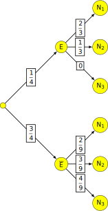

# Devoir surveillé 4

::: tip Exercice 1 [Fonction exponentielle][12]
**Partie A**

Soit $g$ la fonction définie et dérivable sur $\R$ telle que, pour tout réel $x$, $g(x) = - 2x^3 + x^2 - 1.$

1. 

a)  Étudier les variations de la fonction $g$.

<ClientOnly><Solution>
On étudie les variations de la fonction $g$ en déterminant le signe de sa dérivée.
$g$ est une fonction polynôme dérivable sur $\R$:
$g'(x)=-6x^2+2x = 2x(-3x+1)$

Donc la fonction $g$ est strictement décroissante sur $\left ] -\infty\,,\,0\right ]$, strictement croissante sur $\left [ 0\,,\, \frac{1}{3}\right ]$, et strictement décroissante sur $\left [ \frac{1}{3}\,,\,+\infty\right [$.
</Solution>

b)  Déterminer les limites de la fonction $g$ en $- \infty$ et en $+ \infty$.

<ClientOnly><Solution>
La fonction $g$ est une fonction polynôme donc sa limite en l'infini est la limite en l'infini de son terme de plus haut degré:

$\displaystyle\lim_{x \to -\infty} g(x) =\displaystyle\lim_{x \to -\infty} -2x^3 = +\infty$ et
$\displaystyle\lim_{x \to +\infty} g(x) =\displaystyle\lim_{x \to +\infty} -2x^3 = -\infty$
</Solution>

1.  Démontrer que l'équation $g(x) = 0$ admet une unique solution dans $\R$, notée $\alpha$, puis que
$\alpha$ appartient à $[-1;0]$.

<ClientOnly><Solution>
(var : 1 TVI : 1 +0.25 intervalle 0.25)\\
$g(0) = -1<0$, $g\left ( \frac{1}{3}\right ) = - \dfrac{26}{27}<0$
On établit le tableau de variations de la fonction $g$:

Sur l'intervalle $]-\infty;0]$, la fonction $g$ est dérivable donc continue, et est strictement décroissante. On a $g(]-\infty;0])=[-1;+\infty[$ , $0$ appartient à cet intervalle $[-1;+\infty[$ , d'après le corolaire du théorème des valeurs intermédiaires , l'équation $g(x)=0$ admet une unique solution dans $]-\infty;0]$.\\

Sur $]0;+\infty[$, le maximum de la fonction est $-\frac{26}{27} $ , donc $g(x)\leq -\frac{26}{27} <0$ et l'équation n'a pas de solution dans $]0;+\infty[$.

On peut déduire  que l'équation $g(x)=0$ admet dans $\R$ une unique solution $\alpha$,de plus $g(0) = -1<0$ et $g(-1)=2>0$ donc $\alpha$ appartient à l'intervalle $\left] -1\,,\, 0\right[$.
</Solution>

1.  Donner un arrondi au dixième de $\alpha$ .

<ClientOnly><Solution>
| $-0,66$ |  $0,105$$-0,65$ |  $-0,028$ |

on en déduit que l'arrondi au dixième de $\alpha$est $-0.7$
</Solution>

4.  En déduire le signe de $g$ sur $\R$.

<ClientOnly><Solution>
On déduit également du tableau que $g(x)>0$ sur $\left] -\infty\,,\,\alpha\right[$ et que $g(x)<0$ sur $\left] \alpha\,,\, +\infty\right[$.
</Solution>

**Partie B**

Soit $f$ la fonction définie et dérivable sur $\R$ telle que, pour tout réel $x$,$f(x) = \left(1 + x + x^2 + x^3\right)\text{e}^{-2x + 1}.$

On note $f'$ la fonction dérivée de la fonction $f$ sur $\R$.

1.  Déterminer :$\displaystyle\lim_{x \to - \infty} f(x)$

<ClientOnly><Solution>

$$\left.
\begin{matrix}
\displaystyle\lim_{x\to -\infty} \left (1+x+x^2+x^3\right ) = \displaystyle\lim_{x\to -\infty} x^3 = -\infty\ 
\left.
\begin{matrix}
\displaystyle \lim_{x\to -\infty} -2x+1 = +\infty\\
\text{On pose } X=-2x+1\\
\displaystyle\lim_{X\to +\infty} e^{X} = +\infty
\end{matrix}
\right\rbrace
\implies \displaystyle\lim_{x\to -\infty} e^{-2x+1} = +\infty
\end{matrix}
\right\rbrace
\stackrel{\text{produit}}{\implies}$$
$\displaystyle\lim\left (1+x+x^2+x^3\right )e^{-2x+1} = -\infty$.

Donc $\displaystyle\lim_{x\to -\infty} f(x)=-\infty$.
</Solution>

1. 

a)  Démontrer que, pour tout $x > 1$, $1 < x < x^2 < x^3.$

<ClientOnly><Solution>
On multiplie l'inégalité $x>1$ par $x$ (strictement positif): $x^2>x$. On multiplie cette dernière inégalité par $x$ et on obtient $x^3 >x^2$.

Pour $x>1$, on a donc: $1<x<x^2<x^3$.
</Solution>

b)  En déduire que, pour $x > 1$, $0 < f(x) < 4x^3 \text{e}^{-2x + 1}.$

<ClientOnly><Solution>
Pour $x>1$, on a $1<x<x^2<x^3$ donc $0<1+x+x^2+x^3 < 4x^3$.

Comme pour tout $x$, $e^{-2x+1}>0$, l'inégalité $0<1+x+x^2+x^3 < 4x^3$ entraîne \\
$0< \left (1+x+x^2+x^3\right )e^{-2x+1} < 4x^3 e^{-2x+1}$ ou autrement dit: $0< f(x) < 4x^3 e^{-2x+1}$
</Solution>

c)  On admet que, pour tout entier naturel $n$,\: $\displaystyle\lim_{x \to + \infty} x^n\text{e}^{-x} = 0$.

Vérifier que, pour tout réel $x$,\: $4x^3\text{e}^{-2x + 1} = \dfrac{\text{e}}{2} (2x)^3\text{e}^{-2x}$ puis en déduire :
$$\lim_{x \to + \infty} 4x^3\text{e}^{-2x + 1}$$

<ClientOnly><Solution>
$$\left.
\begin{matrix}
e^{-2x+1} = e^{-2x} \times e^{1} = e e^{-2x}\\
4x^3 = \dfrac{8x^3}{2} = \dfrac{1}{2} \left (2x\right )^3
\end{matrix}
\right\rbrace
\implies
4x^3e^{-2x + 1} = \dfrac{e}{2} (2x)^3e^{-2x}$$

$$\left.
\begin{matrix}
\displaystyle\lim_{x\to +\infty} 2x = +\infty\\
\text{On pose } X = 2x\\
\displaystyle\lim_{X\to +\infty} X^3 e^{-X} = 0
\end{matrix}
\right\rbrace
\implies
\displaystyle\lim_{x\to +\infty} (2x)^3 e^{-2x} = 0
\iff
\displaystyle\lim_{x\to +\infty} 4x^3 e^{-2x+1} = 0$$
</Solution>

d)  On note $\mathcal{C}_f$ la courbe représentative de $f$ dans un repère orthonormé $(O;\vec{i},\vec{j})$.

En utilisant la question précédente, déterminer la limite de $f$ en $+ \infty$ et en donner une
interprétation graphique.

<ClientOnly><Solution>
D'après la question précédente, si $x>1$, alors $0<f(x)<4x^3e^{-2x+1}$. Si $x$ tend vers $+\infty$, on peut supposer que $x>1$ donc l'inégalité $0<f(x)<4x^3e^{-2x+1}$ est vérifiée.

On sait que $\displaystyle\lim_{x\to +\infty} 4x^3 e^{-2x+1} = 0$ donc, d'après le théorème des gendarmes, $\displaystyle\lim_{x\to +\infty} f(x)= 0$.

On en déduit que la courbe $\mathcal C_f$ admet l'axe des abscisses comme asymptote horizontale en $+\infty$.
</Solution>

3.   Démontrer que, pour tout $x$ de $\R$,\: $f'(x) = \left(- 2x^3 + x^2 - 1\right)\text{e}^{-2x + 1}$.

<ClientOnly><Solution>
La fonction $f$ est dérivable sur $\R$ et

$f'(x) = \left ( 1+2x+3x^2\right )e^{-2x+1} + \left (1+x+x^2+x^3\right ) (-2) e^{-2x+1}\\
\phantom{f'(x)}
= \left ( 1+2x+3x^2 -2 -2x -2x^2 -2x^3 \right ) e^{-2x+1}
= \left ( -2x^3 +x^2 -1\right ) e^{-2x+1} = g(x) e^{-2x+1}$
</Solution>

4.   À l'aide des résultats de la partie A, déterminer les variations de $f$ sur $\R$.

<ClientOnly><Solution>
Pour tout $x$, $e^{-2x+1}>0$ donc $f'(x)$ est du signe de $g(x)$.

 Donc:
+ sur $\left] -\infty\,,\,\alpha\right[$, $f'(x)>0$ donc $f$ est strictement croissante sur $\left] -\infty\,,\,\alpha\right[$;

+ sur $\left] \alpha \,,\,+\infty\right[$, $f'(x)<0$ donc $f$ est strictement décroissante sur $\left] \alpha \,,\,+\infty\right[$. 

</Solution>

:::

::: tip Exercice 2 [Probabilités][10]

Les $300$ personnes travaillant dans un immeuble de bureaux de trois niveaux ont répondu aux deux questions suivantes :

+  «  À quel niveau est votre bureau ?  » 

+ «  Empruntez-vous l'ascenseur ou l'escalier pour vous y rendre ?  » 

Voici les réponses :

+ 225 personnes utilisent l'ascenseur et, parmi celles-ci, 50 vont au $1^{er}$ niveau, 75 vont au $2^{e}$ niveau et 100 vont au $3^{e}$ niveau.

+ Les autres personnes utilisent l'escalier et, parmi celles-ci, un tiers va au $2^{e}$ niveau, les autres vont au $1^{er}$ niveau.

On choisit au hasard une personne de cette population.
On pourra considérer les évènements suivants :

+  $N_{1}$ :  «  La personne va au premier niveau.  » 

+  $N_{2}$ :  «  La personne va au deuxième niveau.  » 

+  $N_{3}$ :  «  La personne va au troisième niveau.  » 

+  $E_{1}$ :  «  La personne emprunte l'escalier.  » 

1.  Traduire l'énoncé à l'aide d'un arbre pondéré.

<ClientOnly><Solution>
Sur 300 personnes, 225 utilisent l'escalier ; $p\left(\overline{E}\right) = \dfrac{225}{300} = \dfrac{3}{4}$. D'où
$p(\text{E}) = 1 - p\left(\overline{E}\right) = \dfrac{1}{4}$.

Sur les 225 personnes empruntant l'ascenseur la répartition 50, 75, 100 suivant les étages conduit à :
 $$ p_{\overline{E}}\left(N_{1}\right) = \dfrac{50}{225} = \dfrac{2}{9}, \quad p_{\overline{E}}\left(N_{2}\right) = \dfrac{75}{225} = \dfrac{3}{9}, \quad p_{\overline{E}}\left(N_{3}\right) = \dfrac{100}{225} = \dfrac{4}{9} $$ 
Sur les 75 personnes empruntant l'escalier, on obtient de même :
 $$ p_{E}\left(N_{1}\right) = \dfrac{1}{3}, \quad p_{E}\left(N_{2}\right) = \dfrac{2}{3}, \quad p_{E}\left(N_{3}\right) = \dfrac{0}{3} $$ 

</Solution>

1. 

a)  Montrer que la probabilité que la personne aille au $2^{e}$ niveau par l'escalier est   égale à $\dfrac{1}{12}$.

<ClientOnly><Solution>
On a $p\left(\text{E} \cap \text{N}_{2} \right) = p(\text{E}) \times p_{\text{E}}\left(\text{N}_{2}\right) = \dfrac{1}{4} \times \dfrac{1}{3} = \dfrac{1}{12}$.
</Solution>

b)  Justifier que la probabilité que la personne aille au $2^{e}$ étage est $\frac{1}{3}$

<ClientOnly><Solution>
$E$ et $\overline{E}$ définissent une partition de l'ensemble des personnes , d'après la loi des probabilités totales :
$P(N_2)=P(E\cap N_2)+P(\overline{E} \cap N_2)$\\
$P(N_2)=P(E)\times P_{E}(N_2)+P(\overline{E} )\times P_{\overline{E}}(N_2)$\\
$P(N_2)=\frac{1}{4}\times \frac{1}{3}+\frac{3}{4}\times \frac{3}{9}$\\
$P(N_2)=\frac{1}{3}$
</Solution>

c)  Montrer que les évènements $N_{1}$, $N_{2}$ et $N_{3}$ sont équiprobables.

<ClientOnly><Solution>
Vont au $1^{er}$ étage : 50 (ascenseur) + $75 \times \dfrac{2}{3} = 50 = 100$ personnes ;

Vont au $2^{e}$ étage : 75 (ascenseur) + $75 \times \dfrac{1}{3} = 25 = 100$ personnes ;

Vont au $3^{e}$ étage :  100 (ascenseur) personnes.
ou bien :
$P(N_1)=P(E\cap N_1)+P(\overline{E} \cap N_1)$\\
$P(N_1)=P(E)\times P_{E}(N_1)+P(\overline{E} )\times P_{\overline{E}}(N_1)$\\
$P(N_1)=\frac{1}{4}\times \frac{2}{3}+\frac{3}{4}\times \frac{2}{9}$\\
$P(N_1)=\frac{1}{3}$\\
et \\
$P(N_3)=P(E\cap N_3)+P(\overline{E} \cap N_3)$\\
$P(N_3)=P(E)\times P_{E}(N_3)+P(\overline{E} )\times P_{\overline{E}}(N_3)$\\
$P(N_3)=\frac{1}{4}\times 0+\frac{3}{4}\times \frac{4}{9}$\\
$P(N_3)=\frac{1}{3}$
Les évènements N$_{1}$, N$_{2}$, N$_{3}$ sont bien équiprobables.
</Solution>

d)  Déterminer la probabilité que la personne emprunte l'escalier sachant qu'elle va au $2^{e}$ niveau.

<ClientOnly><Solution>
Il faut trouver : $p_{N_{2}}(E) = \dfrac{p\left(E \cap N_{2}\right)}{p\left(N_{2}\right)} = \dfrac{\frac{1}{12}}{\frac{1}{3}} = \dfrac{1}{4}$
</Solution>

3.  On interroge désormais 20personnes de cette population. On suppose que leurs réponses sont indépendantes les unes des autres.

On appelle $X$ la variable aléatoire qui, aux 20personnes interrogées, associe le nombre de personnes allant au $2^{e}$	niveau.

a)  Déterminer la loi de probabilité de la variable aléatoire $X$.

<ClientOnly><Solution>
On considère l'expérience de Bernoulli "On interroge une personne prise au hasard parmi les 300 "  dont le succès $S$ est "elle va au $2^{e}$ étage".

On a alors $P(S)=p\left(N_{2} \right) = \dfrac{1}{3}$.

On répète cette expérience 20 fois de manière identique et indépendante.

La variable aléatoire $X$ qui compte le nombre de personnes allant au $2^{e}$ étage, suit une loi binomiale de paramètres $p = \dfrac{1}{3}$ et $n = 20$.
</Solution>

b)  Déterminer, à $10^{-4}$ près, la probabilité que 5 personnes exactement aillent au $2^{e}$ niveau.

<ClientOnly><Solution>
On a donc :

$p(X = 5) = \binom{20}{5} \times \left(\dfrac{1}{3} \right)^{5} \times \left(1 - \dfrac{1}{3} \right)^{20 - 5} = 15504\times \dfrac{2^{15}}{3^{20}} \approx 0,1457.$ 	ou utilisation de la calculatrice
</Solution>

c)  En moyenne sur les 20personnes, combien vont au $2^{e}$ niveau?

<ClientOnly><Solution>
La moyenne pour les 20 personnes d'aller au $2^{e}$ étage est égale à l'espérance mathématique de la variable aléatoire $X$, soit : E$(X) = n \times p = 20 \times \dfrac{1}{3} = \dfrac{20}{3} \approx 7$.

Un peu moins de 7 personnes sur 20 vont au $2^{e}$ étage
</Solution>

1.  Soit $n$ un entier inférieur ou égal à $300$. On interroge désormais $n$ personnes de cette population. On suppose que leurs réponses sont indépendantes les unes des autres.

a)  On souhaite déterminer le plus petit entier $n$ strictement positif tel que la probabilité de l'évènement  «  au moins une personne va au $2^{e}$ niveau  »  soit supérieure ou égale à $0,99$.

Justifier que cela revient à résoudre $1 - \left( \dfrac{2}{3}\right)^n \geqslant 0,99$.

<ClientOnly><Solution>
On reprend la variable aléatoire suivant la loi binomiale de probabilité $\dfrac{1}{3}$ avec $n$ personnes.

Il faut trouver : $p(X \geqslant 1) = 1 - p (X = 0)$ soit  $p(X \geqslant 1) = 1 - \left( \dfrac{2}{3}\right)^n$.

La condition est réalisée si :$1 - \left( \dfrac{2}{3}\right)^n \geqslant 0,99$
</Solution>

b)  Déterminer, parmi les 4  algorithmes proposés, celui qui affichera la valeur de $n$ souhaitée à la fin de son exécution.
(justifier par élimination, en expliquant ce qui ne convient pas).

Algorithme 1

$u\leftarrow 0$

$n\leftarrow 0$

Tant que  $u < 0,99$

$n\leftarrow n+1$

$u \leftarrow 1-\left( \frac{2}{3}\right)^n$

Fin tant que

Afficher $n$

Algorithme 2\\
$u\leftarrow 0$\\
$n\leftarrow 0$\\
Tant que  $u < 0,99$\\
$u \leftarrow 1-\left( \frac{2}{3}\right)^n$\\
$n\leftarrow n+1$\\
Fin tant que\\
Afficher $n$

Algorithme 3\\
$u\leftarrow 0$\\
$n\leftarrow 0$\\
Tant que  $u \geq 0,99$\\
$n\leftarrow n+1$\\
$u \leftarrow 1-\left( \frac{2}{3}\right)^n$\\
Fin tant que\\
Afficher $n$

Algorithme 4\\
$u\leftarrow 0$\\
$n\leftarrow 0$\\
Tant que  $u \geq 0,99$\\
$n\leftarrow n+1$\\
$u \leftarrow 1-\left( \frac{2}{3}\right)^n$\\
Fin tant que\\
Afficher $n$

**Question bonus (facultative)** : Donner la valeur de $n$

<ClientOnly><Solution>

La condition est: $1 - \left( \dfrac{2}{3}\right)^n \geqslant 0,99$. Il faut donc que la boucle conditionnelle soit : $u<0,99$.
On élimine les algorithmes 3 et 4 .

Dans l'algorithme 2 l'indice $n$ avance avec une valeur de moins que la valeur de $u$.

Eventuellement : L'algo 1 donne la solution:12

Conclusion : sur 12 personnes,  au moins une va au niveau 2 avec une probabilité supérieure ou égale à $0,99$.
</Solution>

:::

